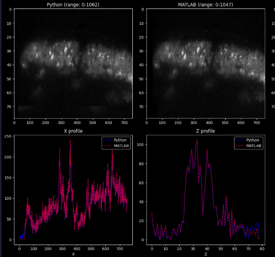
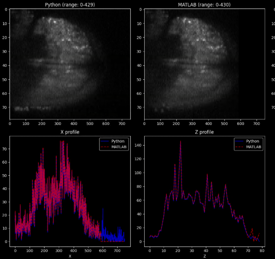

## Notes

- Isoview 2 timepoints
E:\isoview\SPM00\TM000000
Working through isoview -> matlab and python

1. Make sure your orientation is correct (flip v, flip z?)
2. Estimate/apply offset needed to register cameras onto each other
3. Estimate/apply cam->cam intensity correction
4. Create mask of only informative pixel values (segmentation mask)

Check with matlab: 

  Would be nice to not need to track fliph flipv

  Registraion seems to use the pre-blend zones to register cams onto each other

What state do we want the matlab pipeline to remain in:

  Lots of hardcoding in the matlab scripts, users need to open and maintain several run-files

  At the very least we could make these into functions and put some work into where the jobParameters outputs go

## Intensity Correction

Need to compute on the only pixels included in the segmentation masks, exclude the 0's and anomolies
Otherwise, intensity incorrectly adjusted upward

The problem looks like adaptive blending, whereas geometric blending is very similar in terms of dynamic range.

