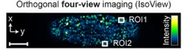

## Notes

- ClusterPT changes/differences:
   - python global segmentation mask in 1 step
   - `coreMemory`: No memory management or cluster submission
   - no `jpeg` filetypes

### Confusion about thresholds

Why there are 2 values for the adaptive threshold [0.4 0.4] but the comment says "use only 1 value if references is empty", but this script still has 2 values and references is empty. 

1. In the matlab pipeline, what happens with 1 vs 2 values for the threshold (thresholds)
2. does it still work this way? is it differnet if this script used [0.4] vs [0.4, 0.4]? 
3. Does the python pipeline handle this the same way ?

```matlab
if isempty(references)
    references = channels';
    dependents = [];
    if numel(thresholds) ~= numel(references)
        thresholds = ones(numel(references), 1) .* thresholds(1);
    end;
end;
```

Python: `segment_threshold`: applies to all channels.

!Note: I think `mbo_utilities` would handle `clusterPT` nicely, allowing easier cropping, visualizing adaptive thresholds and xz / xy slices


### Struggling with X vs Y, height vs width

Y is the long axis, X is the short axis: 


- Cropping is applied **before rotation**, so its opposite of the viz
- Flipping is applied **after rotation**, so its the same as the viz

Parameters:

Path: `E:\isoview\Dme_E1_57C10_GCaMP6s_Simultaneous_6p22_20150528_163012.corrected\output\TM000000`

```python
config = ProcessingConfig(
    input_dir=input_dir,
    output_dir=input_dir.parent / f"{input_dir.name}.corrected" / subdir,
    projection_dir=input_dir.parent / f"{input_dir.name}.projections" / subdir,
    specimen=0,
    # timepoints=None, # None for all timepoints, or a list of timepoints
    timepoints=[0], # 0-indexed (for now), None for all timepoints, or a list of timepoints
    cameras=[0, 1],
    channels=[1],

    # segmentation: 0=none, 1=segment+mask, 2=masks only, 3=global mask
    segment_mode=1,
    gauss_kernel=5,
    gauss_sigma=3.0,
    segment_threshold=0.2,

    # cropping - values are [cam0, cam1] in pre-rotation coordinates
    # array is transposed [X -> Y] relative to what's viewed in the GUI
    crop_top=[100, 100],       # y start
    crop_height=[640, 640],    # y size
    crop_left=[350, 350],      # x start
    crop_width=[1250, 1250],   # x size
    crop_front=[5, 5],         # z start
    crop_depth=None,           # z to end

    # transforms: rotation (0=none, 1=90cw, -1=90ccw)
    # only acts on the second camera
    rotation=1,
    flip_horizontal=True,
    flip_vertical=False,

    # pixel correction
    median_kernel=(3, 3),
    background_percentile=5.0,
    mask_percentile=1.0,
    subsample_factor=100,

    # output: tif, klb or zarr
    output_format="tif",
    # zarr_compression="blosc-zstd",
    # zarr_compression_level=9,
)
```

- Fixed a bug causing `xz` mask which should be `xy`.
- Not yet concerned with metadata
