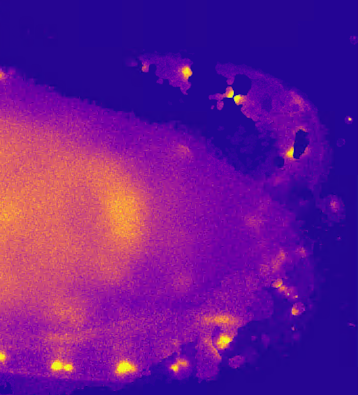
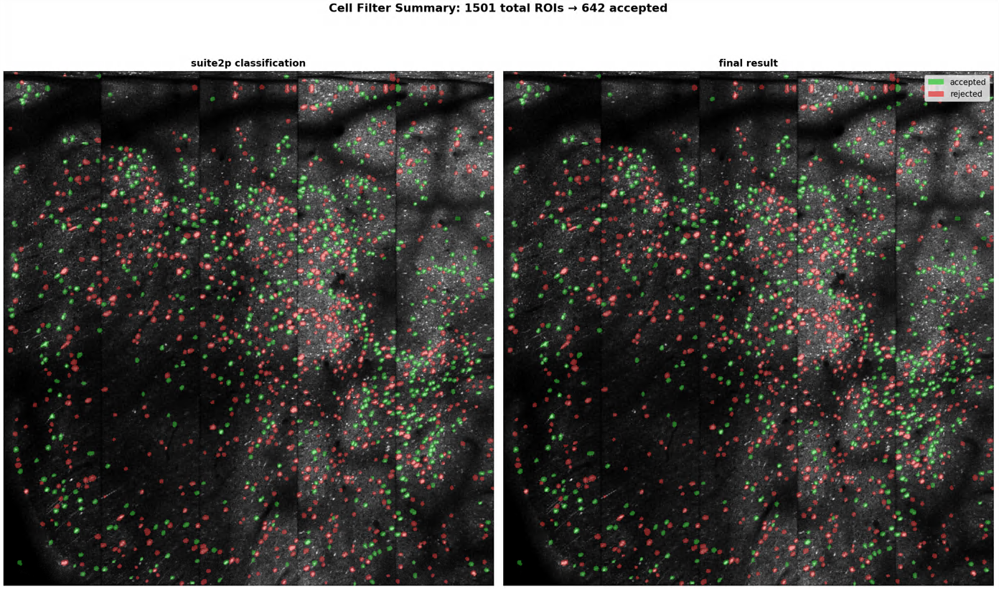

## Notes

- Continuing on Channel x Channel fusion 
- The registration / rotation is not producing accurate results at the moment

NOTE: Matlab expects `inputString/SPM00/TM000000/`
      Python is using `inputString/TM000000/`

### Dark spots in the FOV

### mbo-utilities

Christians data is running. The default cell filter is rejecting too many cells: 

