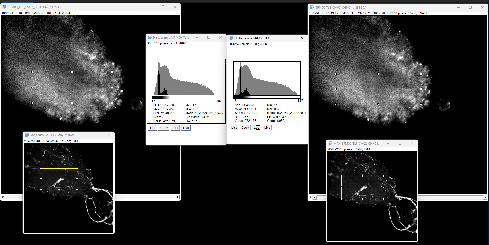

## Notes

- Housekeeping server: backup not on s1_data
- All exploratory should go in mbospace, s1data is getting filled up
- Clean up mbospace
- ClsterPT: No bugs, but make the output structure the same, spm and what not 
  - zarr v3 / zarr v2, if v2, keep note that v3 is still 
multi-fuse run in matlab, check for spikes
housekeeping

### Running Tiled data in MATLAB

I've created two new files:

clusterPT_tiled.m - The main orchestration script for tiled data
processTimepoint_tiled.m - The worker function (exact copy of processTimepoint_RC.m with minimal changes)
Key changes from the original:

Input format:

TL1/TL1_CM0.stack, TL1/TL1_ch00.xml, etc.
Output format:

TL1.corrected/SPM00/TL1/SPM00_TL1_CM02_CHN01.klb
TL1.corrected.projections/SPM00_TL1_CM02_CHN01.xyProjection.klb
Naming changes (TL instead of TM):

TM000001 -> TL1 (tile name preserved)
SPM00_TM000001_CM00_CHN00 -> SPM00_TL1_CM00_CHN00
Minimal code changes:

Added inputType = 5 for tiled data
Added tileName parameter passed through parameterDatabase
Changed file path construction to use TL#_CM#.stack and TL#_ch##.xml
Changed output subfolder from TM###### to tile name (TL1, TL2, etc.)
All processing logic (rotation, flipping, dead pixel correction, segmentation, Gaussian filtering) is preserved exactly from processTimepoint_RC.m
To use:

Edit clusterPT_tiled.m to set your inputRoot and tileNames
Run clusterPT_tiled.m in MATLAB

## Matlab and python tiled outputs 

Matlab (L) Python (R)

