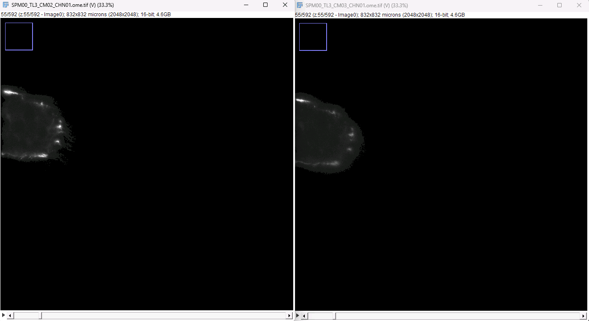
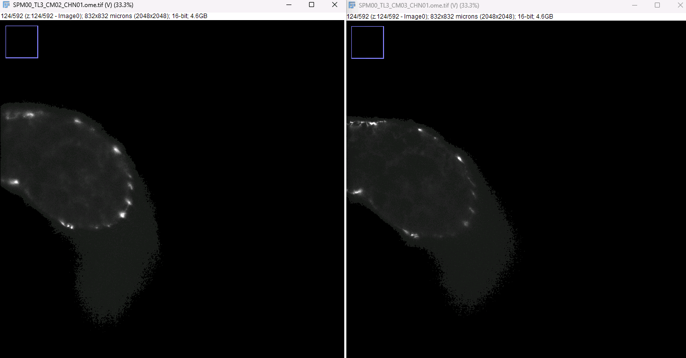
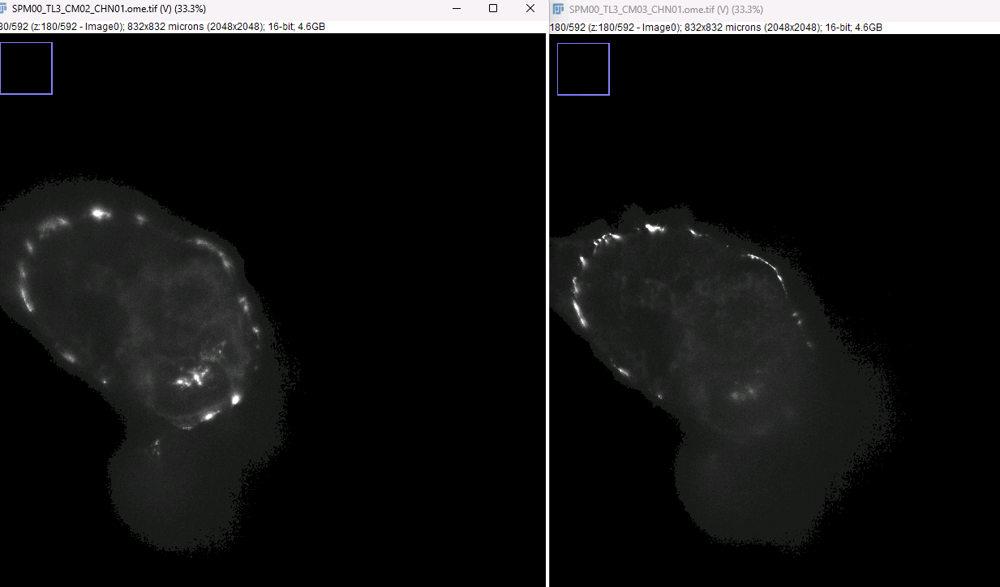
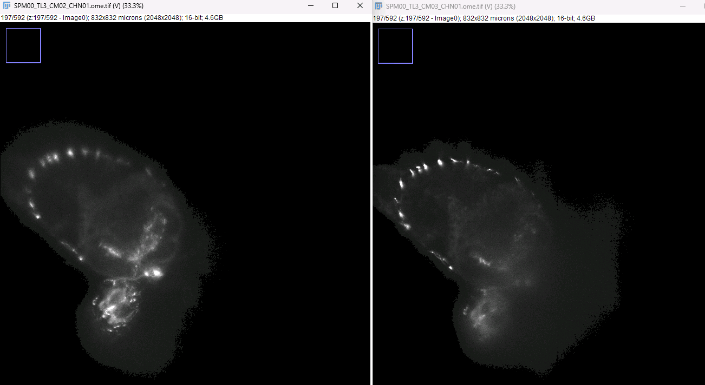
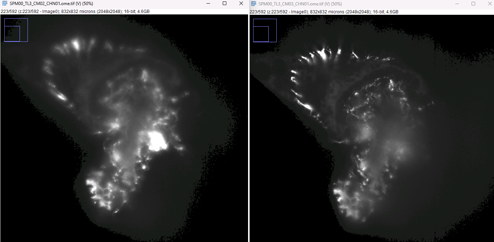
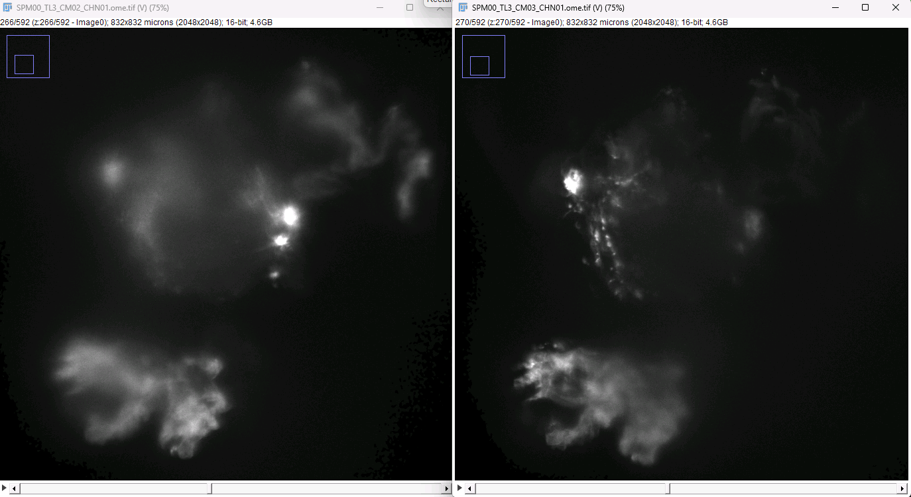

New directives from Raghav 02/10/2026:

OME-TIFF:
1. Compression, Zstandard
2. Resolution Levels
3. Specimin Position in OME metadata
4. MultiProcessing, speed optimizations

https://webknossos.org/annotations/698ca6390100001d0156844f#1080,1185,332,0,2.787

TL3, Cam02/03

1. z=0-61, Cam02 clearly dominates

2. z=120, Cam02 dominates, Cam03 has some sharper signal regions

3. z=180, similar as z=120

4. z=200

5. z=235, Cam03 starts to dominate

6. z=266, Cam03 dominates but regions in Cam02 that have signal where Cam03 doesn't

