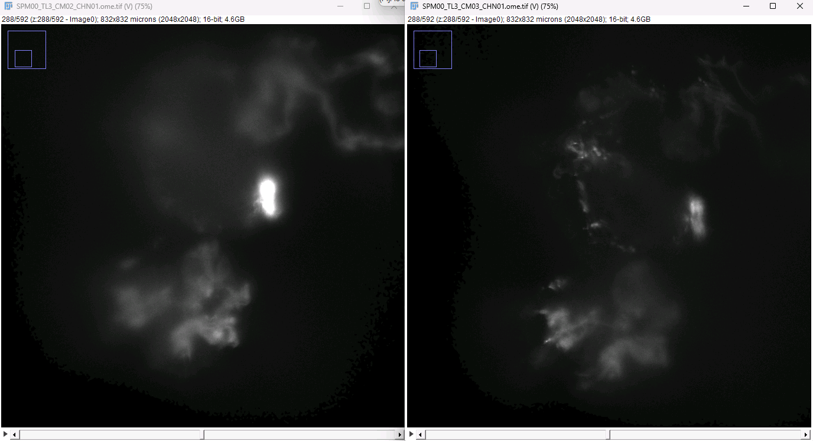
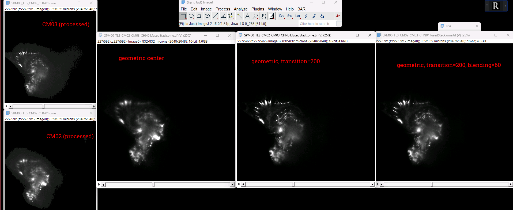
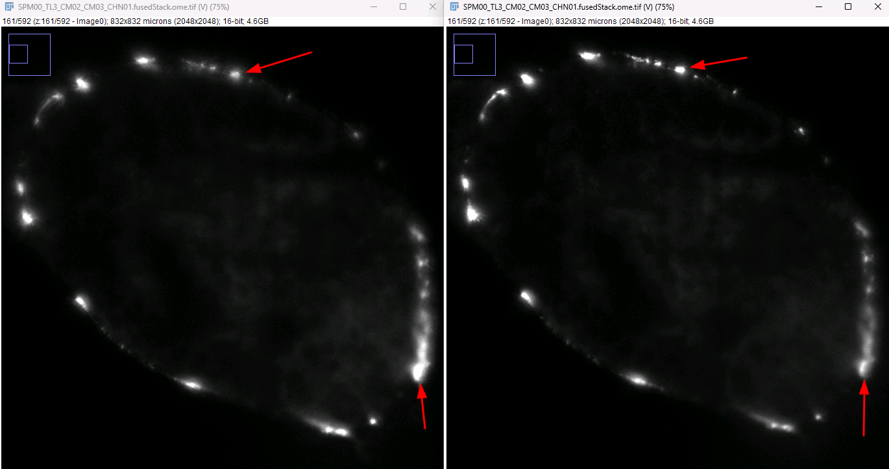
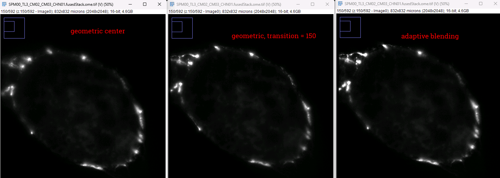
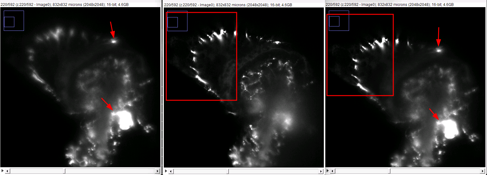
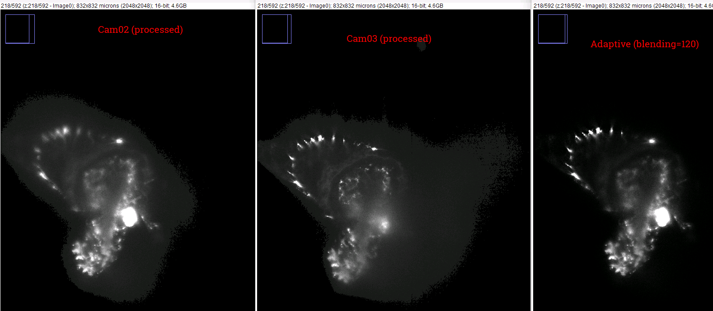
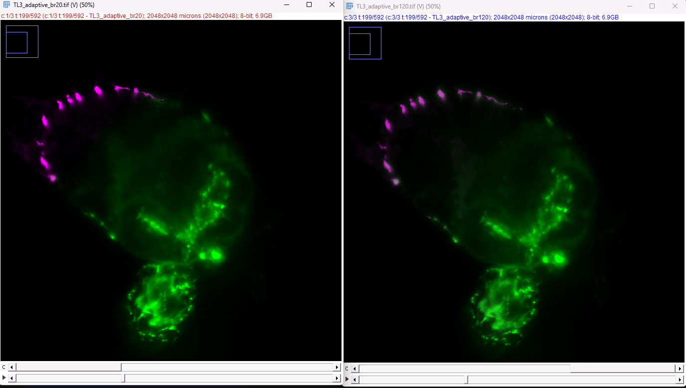

New directives from Raghav 02/10/2026:

OME-TIFF:
1. Compression, Zstandard
2. Resolution Levels
3. Specimin Position in OME metadata
4. MultiProcessing, speed optimizations

https://webknossos.org/annotations/698ca6390100001d0156844f#1080,1185,332,0,2.787

TL3, Cam02/03

1. z=0-61, Cam02 clearly dominates

2. z=120, Cam02 dominates, Cam03 has some sharper signal regions

3. z=180, similar as z=120

4. z=200

5. z=235, Cam03 starts to dominate

6. z=266, Cam03 dominates but regions in Cam02 that have signal where Cam03 doesn't

7. z=288 is where Cam02 stops having regions that don't exist in Cam03

8. z=325 on looks like this

Different blending modes

- clearly a tradeoff, in a camera where you're missing signal in one section you may have sharper signal in another section

Transition=200 (left), Transition=150(right)

Adaptive blending

Transition=Center (left), T=150 (middle), Adaptive (right)

Adaptive blending in the early zplanes gets the sharp signal from Cam2 and the bright signal from Cam3 thats missing in Cam2. Best of both worlds. 
As Z approaches 210+, we lose this and start getting the blurry signal from Cam2 rather than the sharp counterpart from Cam3. 

Also occurs with blending=120, still not getting the sharp center area

Adaptive with blending=20 vs blending=120:

## Compression

- compression implemented in OME-TIFF via tifffile arguments
- tifffile and zarr have different syntax for compression, need to unify before zarr integration
