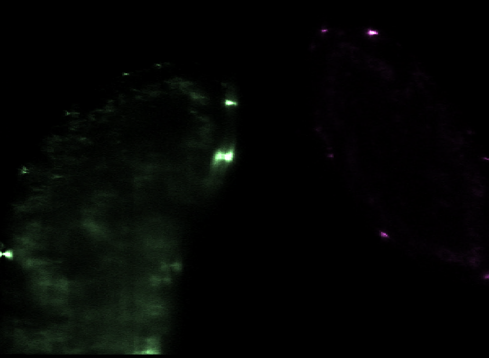
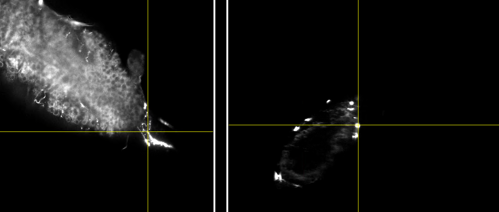

## Notes


Dataset	Raw Size	Compressed	Ratio	Savings
TL1 (4 views)	16.58 GB	2.17 GB	7.65x	86.9%
TL2 (4 views)	23.19 GB	2.27 GB	10.21x	90.2%
TL3 (4 views)	17.40 GB	2.18 GB	7.97x	87.5%
TL4 (2 views)	9.93 GB	0.90 GB	11.03x	90.9%
Total	67.10 GB	7.52 GB	8.92x	88.8%

## Big Data Viewer

- really going to need the specimen positions

TL1 Cm00+Cm01 fusion shows these "doubles", could be a sign of poor registration during camera fusion:


Maybe it's actually biological: 



### Stack direction (metadata)

- Position metadata is the same for both cameras in a channel/tile
- Each tile has 1 position saved
- Ch00/Ch01 are orthogonal: CH00 ScanZ, CH00 ScanY

The fix: 

```text
CH01's calibration matrix is no longer diagonal — it's a
permutation matrix that swaps Y↔Z:

CH00: [px  0    0  ]     CH01: [px  0     0    ]
       [0   px   0  ]            [0   0     ystep]
       [0   0  zstep]           [0   px    0    ]

```


```
CH00 (Z-scanning):
- image column (X) → physical X, scaled by 0.40625 um/px
- image row (Y) → physical Y, scaled by 0.40625 um/px
- image slice (Z) → physical Z, scaled by 2.031 um/slice
- then shift by (stageX, stageY, stageZ)

CH01 (Y-scanning) — axis swap + flip:
- image column (X) → physical X, scaled by 0.40625 um/px
- image slice (Z) → physical Y, scaled by 2.031 um/slice
- image row (Y) → physical Z, reversed (row 0 = top of Z, row 2047 =
bottom of Z), scaled by 0.40625 um/px, offset by 831.6 um so coordinates
stay positive
- then shift by (stageX, stageY, stageZ)
```

What `stack_direction` gives:

The axis swap — the letter tells you the scan axis:
- stack_direction="+Z,-Z" → scan axis = Z → image Z = physical Z
- stack_direction="+Y,-Y" → scan axis = Y → image Z = physical Y


CHN0N (CM00+CM01, +/-Z, +/-Z):
- columns = X
- rows = Y
- slices = Z
- image axes = microscope axes.

CHN0n (CM02+CM03, +/-Y, +/-Y):
- columns = X
- rows = Z (because the cameras are rotated 90°)
- slices = Y (the scan direction)
