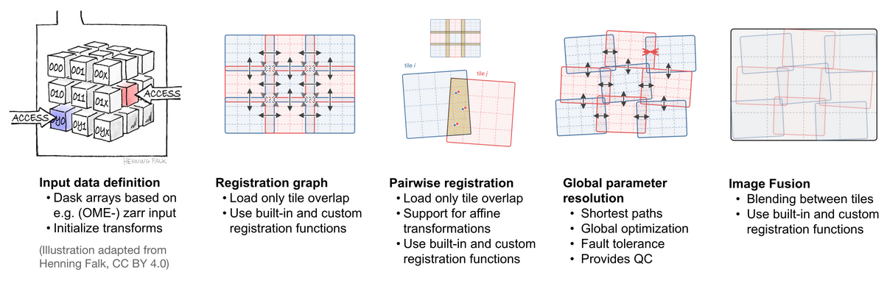
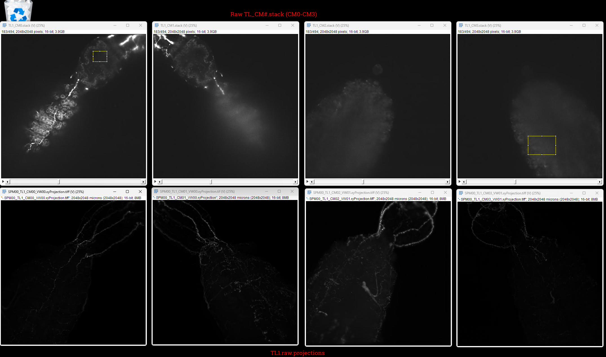
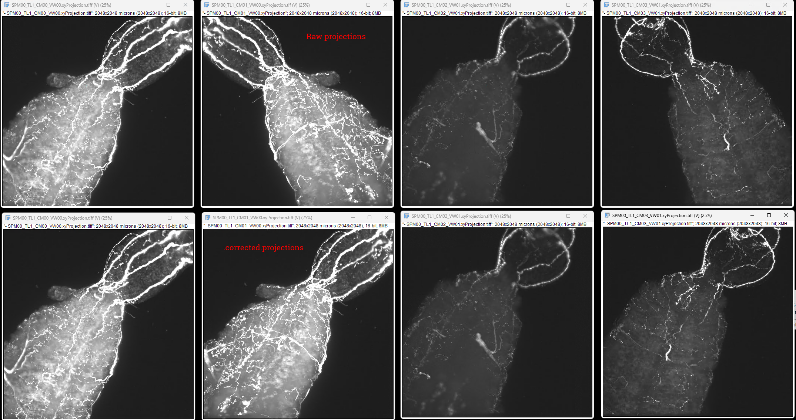

## Zarr V3 + Zarr V2

volume.zarr/
  zarr.json          ← group metadata (zarr v3)
  0/                 ← the ONLY copy of image data
    zarr.json        ← array metadata (shape, chunks, dtype, codecs)
    c/0/0/0          ← actual chunk files (sharded)
    c/0/0/1
    ...

The image data does actually need to be within the multiscales sub-directory, so V2 is definitely not compatible

Zarr v3 is really still behind, the `ome-zarr.py` library is just getting to sharding:
https://github.com/ome/ome-zarr-py/pull/534

Also, no consensus yet on ["CoordinateTransforms"](https://github.com/ome/ome-zarr-py/issues/532#issue-3916706228)

## Tiling 

1. [multiview-stitcher](https://github.com/multiview-stitcher/multiview-stitcher.git)

## Confirm projections, orientation

### Raw import vs raw projections

Top: Raw, loaded via ImageJ
Bottom: raw.projections

### Raw vs corrected projections

Top: raw.projections
Bottom: corrected.projections

## Current state of matlab

Bad

## Adaptive blending artifacts

the per-pixel fallback at line 888-890: when the mask is invalid (z0==0), it averages view1 and view2. But if view2 is zero-padded at that (y,x), averaging halves the signal
- effected by registration offset amount

