## Notes

Isoview: verify matlab has same artifact.

From matlabs multifuse pipeline, adjusted for Ch00->VW00:

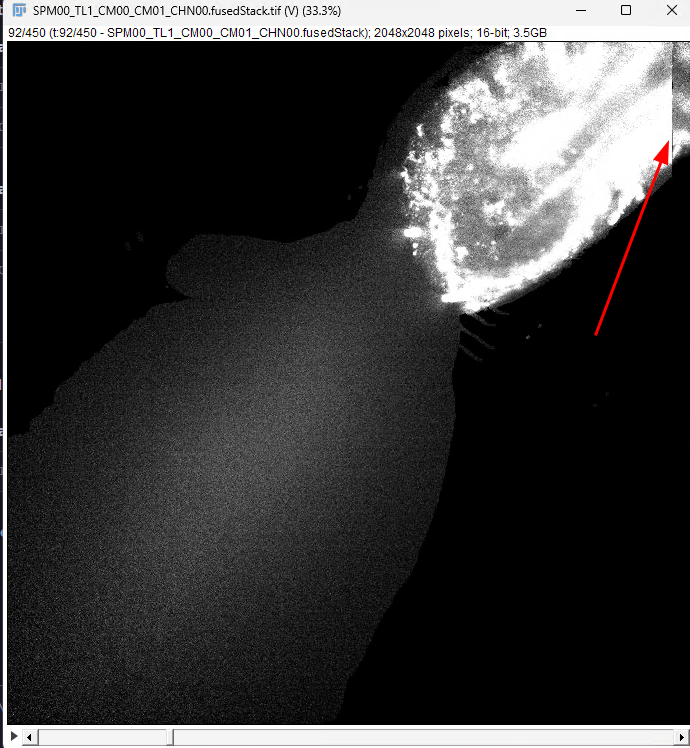

## Orienting Views

### TL1 corrected.projection

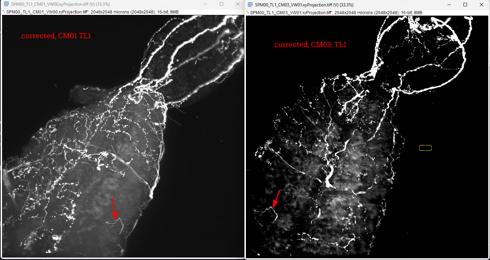

- Rotate 90deg right, flip vertical

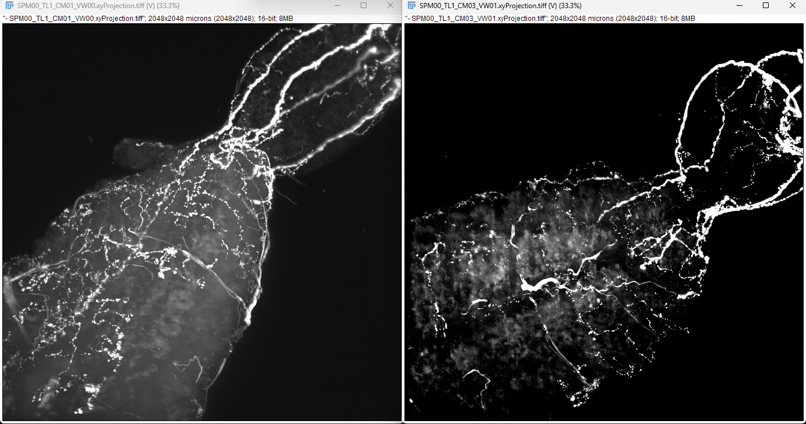

### TL2 corrected.projection

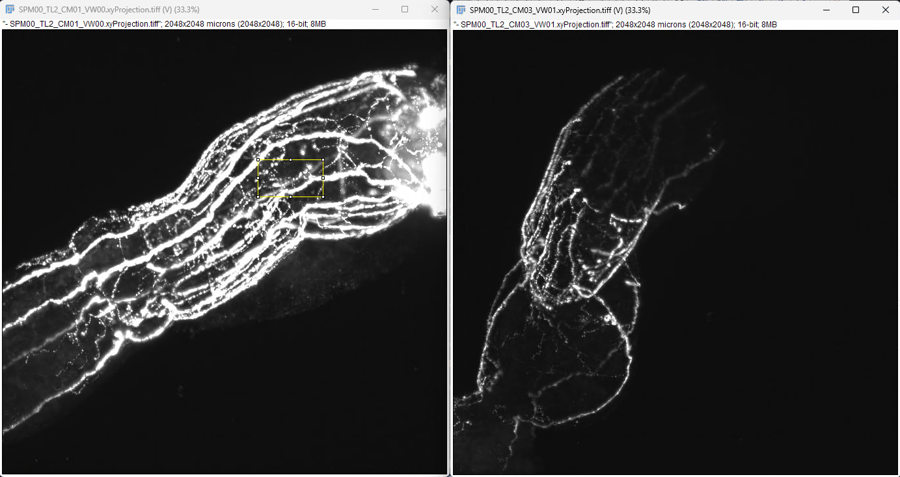

- Rotate 90deg right, flip vertical

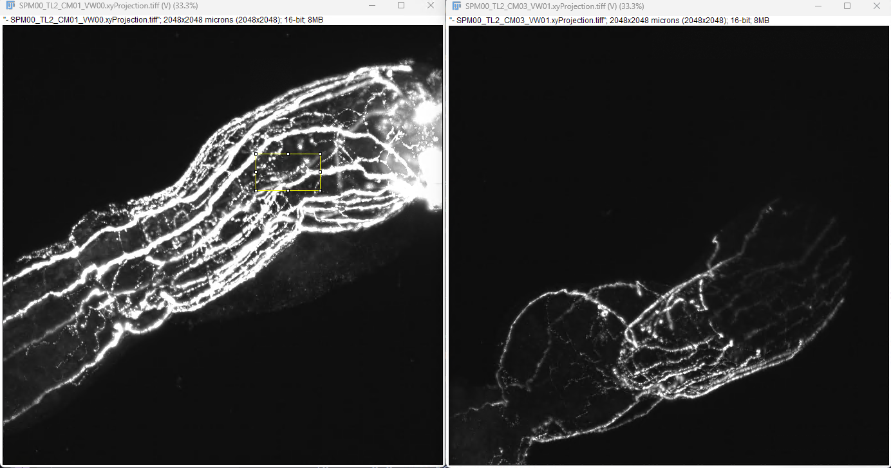

- Rotate 90deg right, flip horizontal

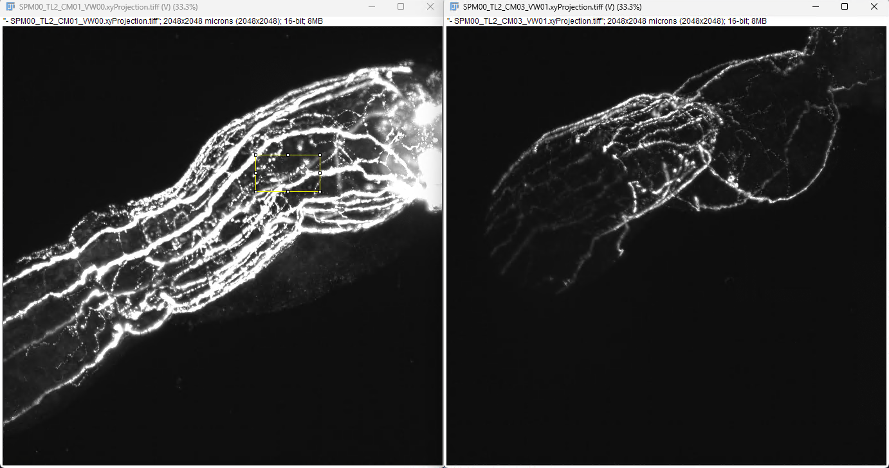

### TL3 corrected.projection

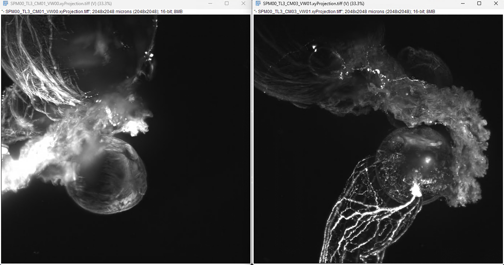

- Rotate 90deg right

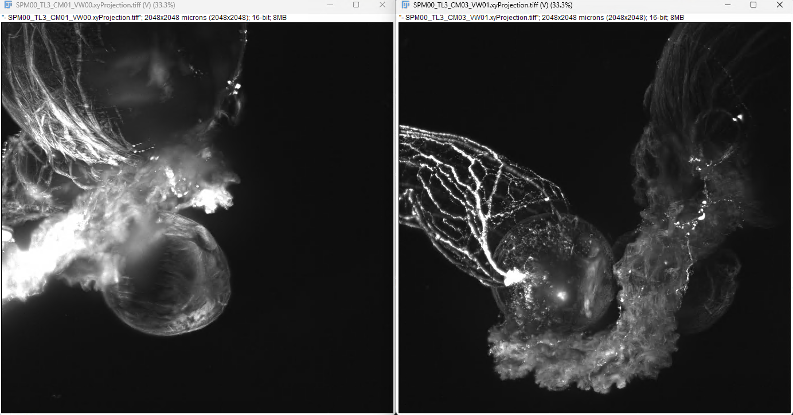

- Rotate 90deg right, flip vertical

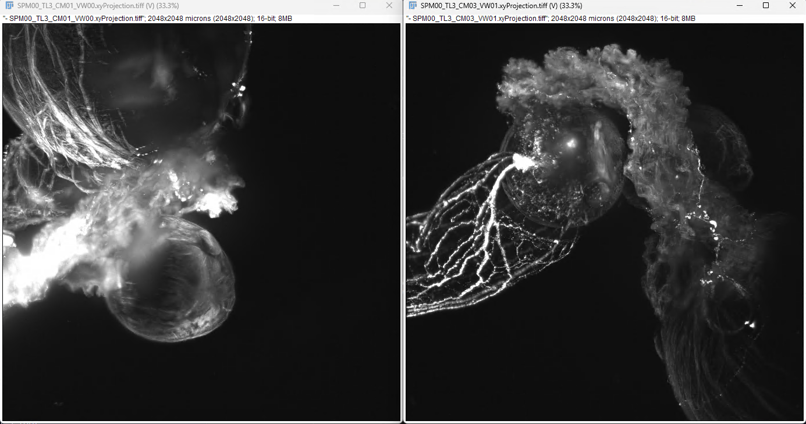

- Rotate 90deg right, flip horizontal

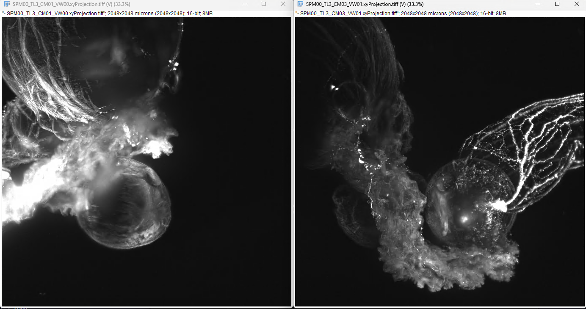

### TL4 corrected.projection

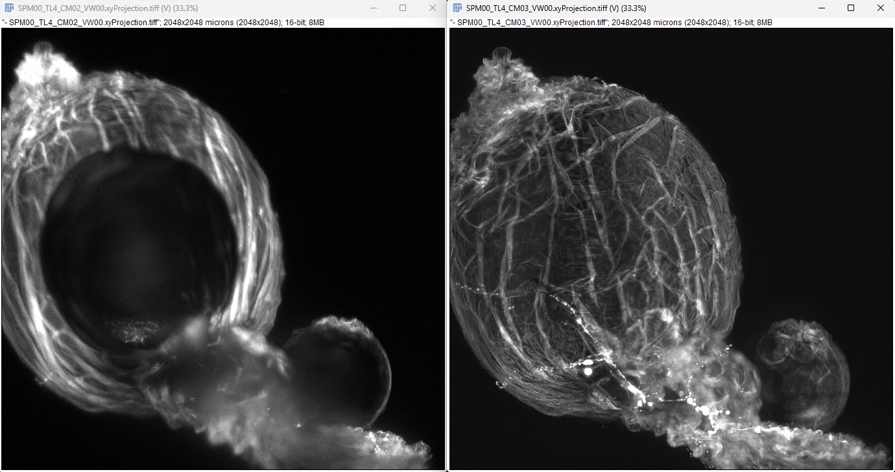

## 2026-02-19 Carson Stringer: Spatial predictive coding in visual cortical neurons

Zhong et al 2025; PMD 40633561 (with code and data)

Supervised (trained with label) vs Un-supervised
- How does the brain actually use unsupervised learning 
- Selectivity index, d`, leaf selective neurons are d` > 0.3 
- Selectivity index, d`, circle selective neurons are d` < -0.3  (? not sure about > or < )
- Before learning, only visual cortex is stimulated, after learning, non-visual bran regions become active 
- Probably RSP is a brain region doing unsupervised learning for this region

* VR is becoming a large paradigm of interest *

- spatial vs temporal predictive coding
- masked auto-encoders, ANN use spatial encoding to make predictions about the world (He, Chen et al 2021)
  - ChatGPT is temporal predictive coding to learn statistics of language

Heatmaps use estimated spikes/s, cells down left side, grouped by selectivity

