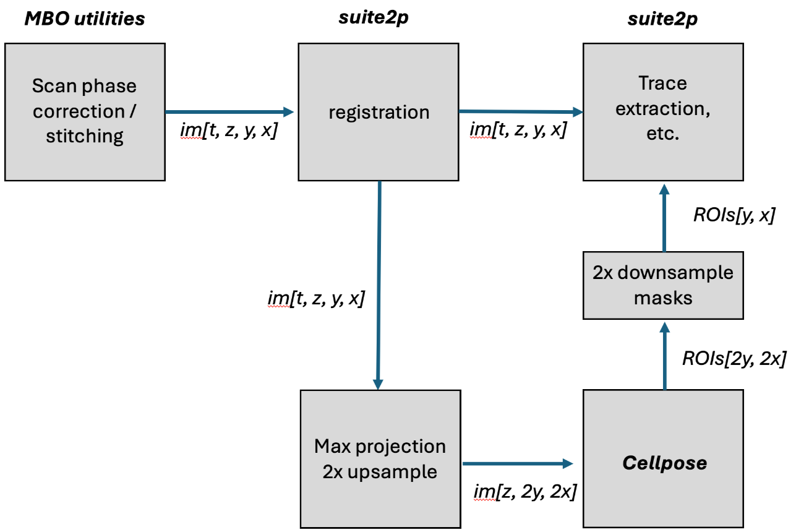
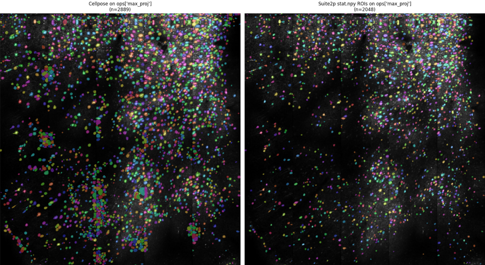

## Microscopy Workshop

- lots of wordy slides
- Why should I learn in the age of AI: "It might happen when AGI is there"
- I really wanted actual microscopy images showing noise, background, what does noise/background removal look like

## Christian Workflow 

- matching suite2p and cellpose workflow

## Isoview Pyramids with Webknossos

- source: `TL1_CM0.stack` (494 x 2048 x 2048, uint16, 4.14 GB)
- voxel size: 0.406 x 0.406 x 2.031 um (XY x Z)

### I/O Settings

| | value |
|---|---|
| zarr | v3 |
| chunks | 64^3 |
| shards | 64 x 512 x 512 |
| codec | transpose -> bytes -> zstd level 5 |
| pyramid | 6 levels, anisotropic median |

## Results

| writer | pyramid | size (MB) | time (s) | throughput (MB/s) |
|--------|---------|----------:|----------:|------------------:|
| isoview | no | 1645 | 11.0 | 150 |
| isoview | 6 levels | 2090 | 61.3 | 34 |
| webknossos | no | 1608 | 28.5 | 56 |
| webknossos | 6 levels | 2047 | 69.3 | 30 |

- isoview flat write is **2.6x faster** (11s vs 29s)
- with pyramids the gap narrows to **1.1x** (61s vs 69s)
- output sizes within 2% of each other

## Webknossos pyramid performance

| step | time (s) |
|------|----------:|
| write base mag | 27.2 |
| downsample 5 levels | 45.3 |
| total | 72.5 |

- wk spends 63% of pyramid time on downsampling, not writing

## Pyramid levels

| level | mag (ZYX) | isoview shape | wk shape (CXYZ) |
|-------|-----------|---------------|-----------------|
| 0 | 1-1-1 | 494x2048x2048 | 1x2048x2048x512 |
| 1 | 1-2-2 | 494x1024x1024 | 1x1024x1024x512 |
| 2 | 1-4-4 | 494x512x512 | 1x512x512x512 |
| 3 | 2-8-8 | 247x256x256 | 1x512x512x256 |
| 4 | 4-16-16 | 123x128x128 | 1x512x512x128 |
| 5 | 8-32-32 | 61x64x64 | 1x512x512x64 |

- same mag sequence, wk pads XY to shard boundary (512)
- isoview stores exact shape, wk stores padded shape

## Format differences

| | isoview | webknossos |
|---|---|---|
| axes | 3D ZYX | 4D CXYZ |
| z-axis | exact (494) | padded to shard boundary |
| pyramid naming | 0/, 1/, 2/ | 1/, 2-2-1/, 4-4-1/ |

## Output files

| file | writer | pyramid |
|------|--------|---------|
| `isoview_flat.zarr/` | isoview | no |
| `isoview_pyr.zarr/` | isoview | 6 levels |
| `wk_flat/` | webknossos | no |
| `wk_pyr/` | webknossos | 6 levels |

