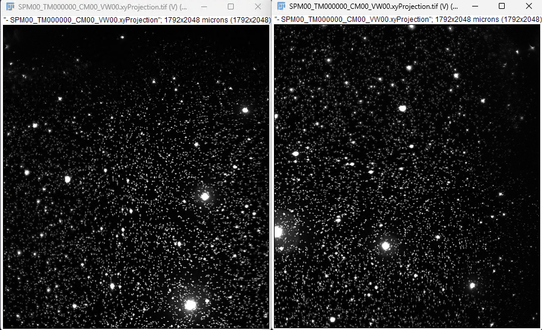
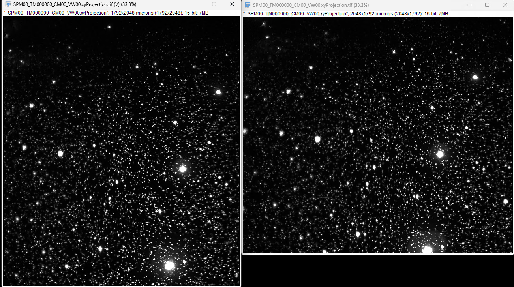
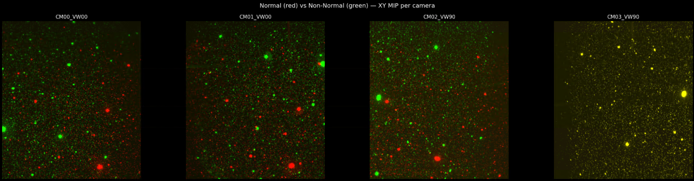

## Orientation and Multi-Processing

Normal vs Rotated-Orientation: CM00 VW00

Rotated-Orientation rotated 90deg CCW:

Normal vs Rotated: `Rotated CM3 VW90` is the same as `Normal CM3 VW90`

- Fix bug with XML filenaming between Tiled and TImelapse
- XML still saved with VW00 VW01 instead of VW00 VW90
- Fix multi-fuse filenames:
    - `Results/MultiFused_adaptive/TM000000/` -> `Results/MultiFused_adaptive/SPM00/TM000000/`

- Set up a benchmark for benchmarking multi-processing while comparing angles

- Spoke with Amol to make a productive meeting to transfer the hard-drive
