### Raw folders

Without sub-folders for raw-data:

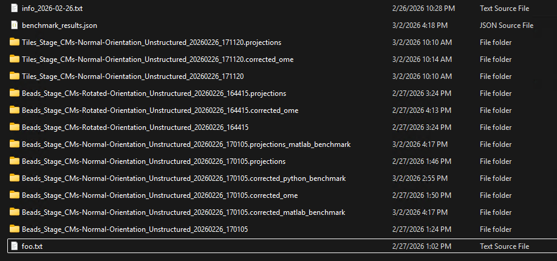

With sub-folders for raw-data:
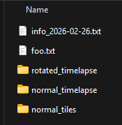

### Orientations

All cameras, raw projections:

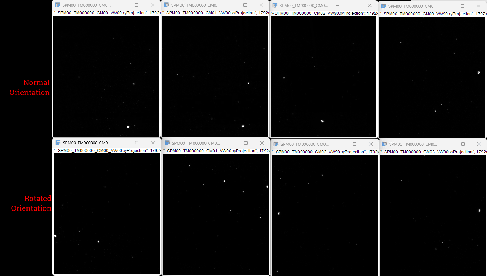

All cameras, raw "non-normal" rotated 90 deg CCW to match

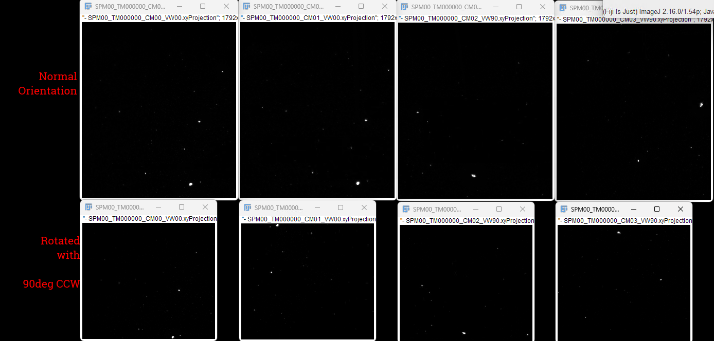

Camera 0:

90 Degrees CCW to match rotation of normal camera:

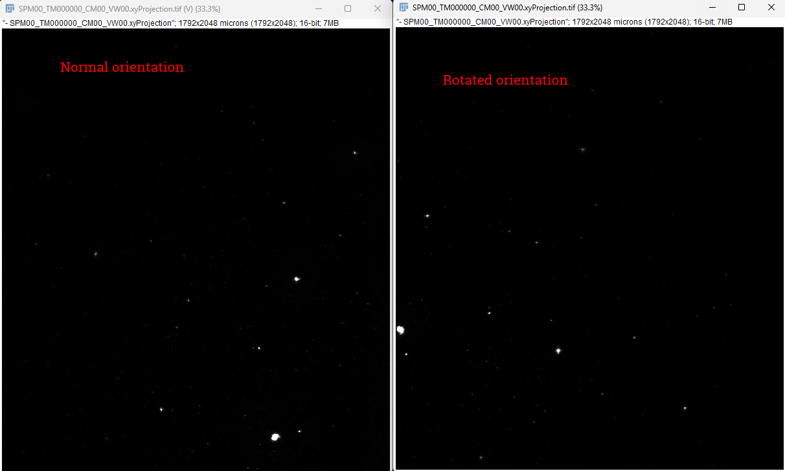

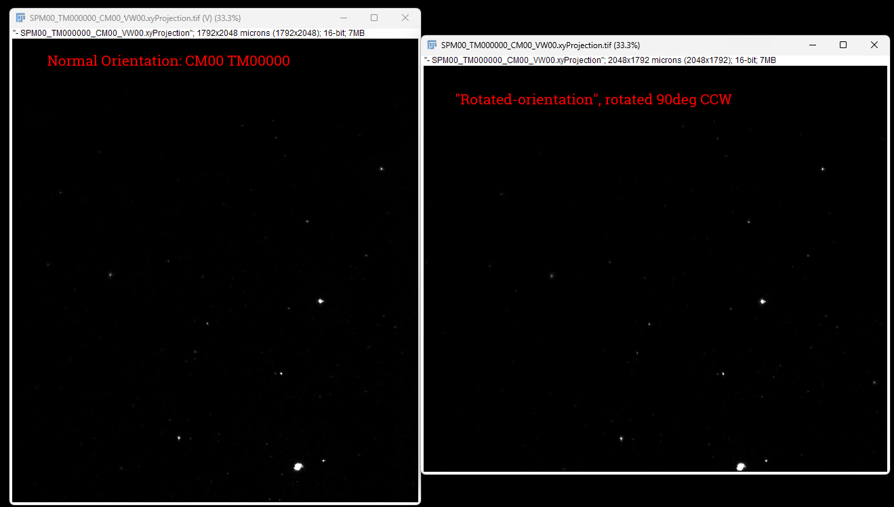

Camera 2

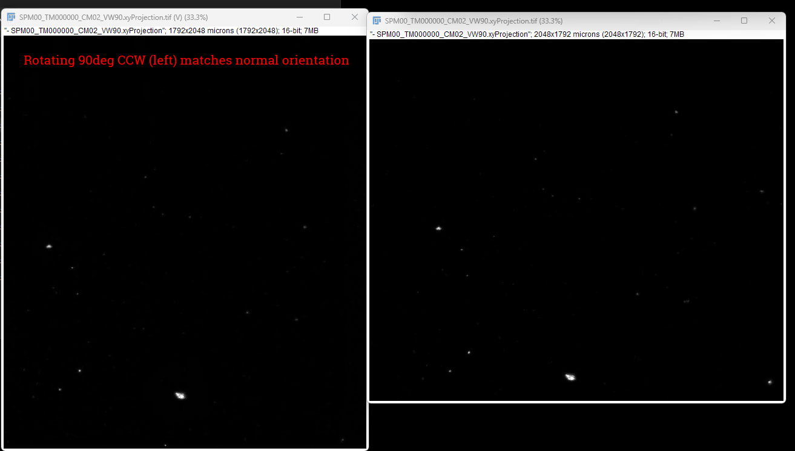

Holds for all but Rotated CM3, Normal CM3

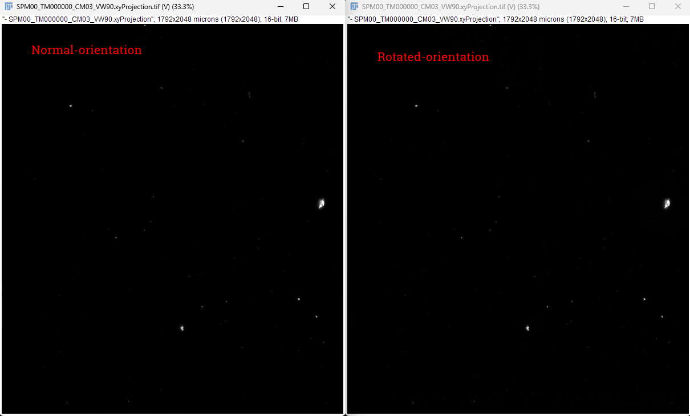

### Matching CM02 -> CM00

Projections are not enough to tell whats going on here:

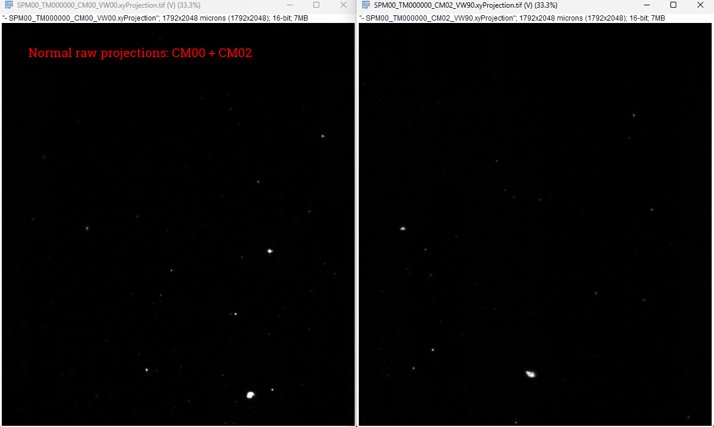

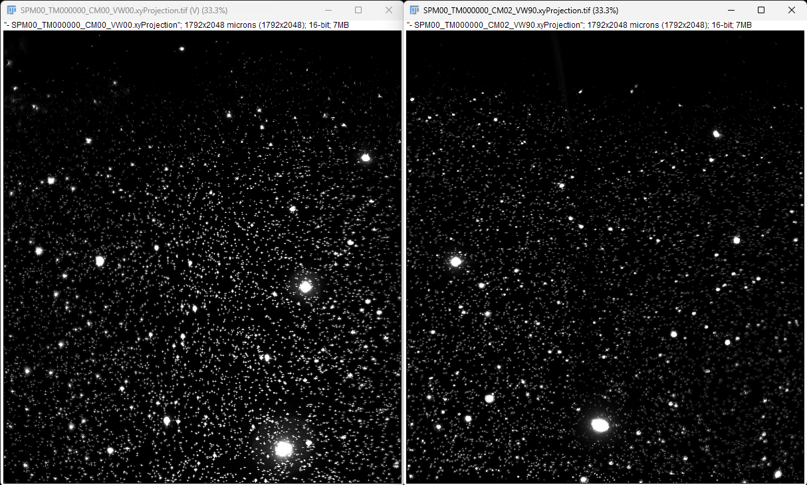

Row 1: CM00 (raw)
Row 2: CM02 (raw)
Row 3: CM02 (oriented)

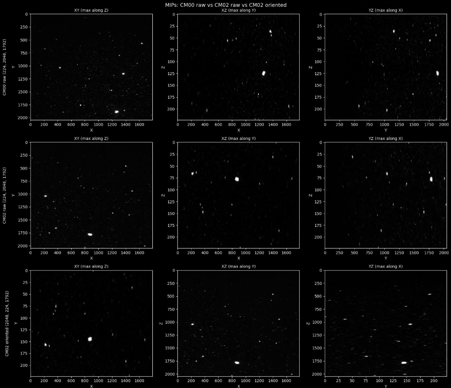

Find which row matches all orientations:

.. not the top row

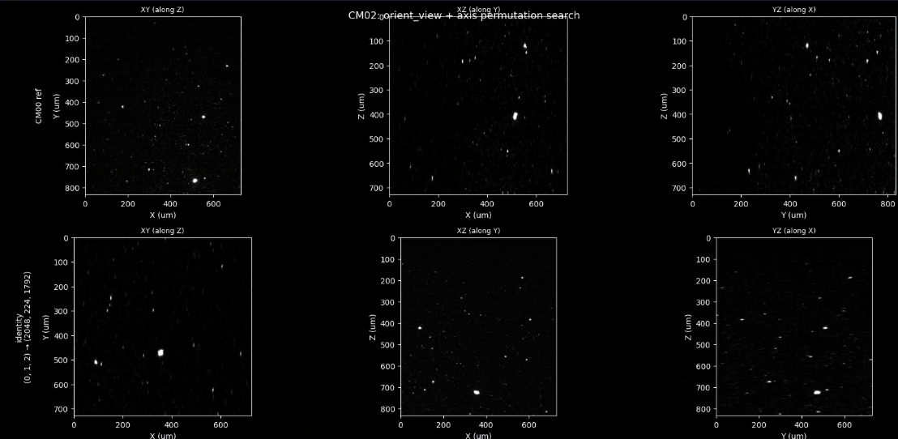
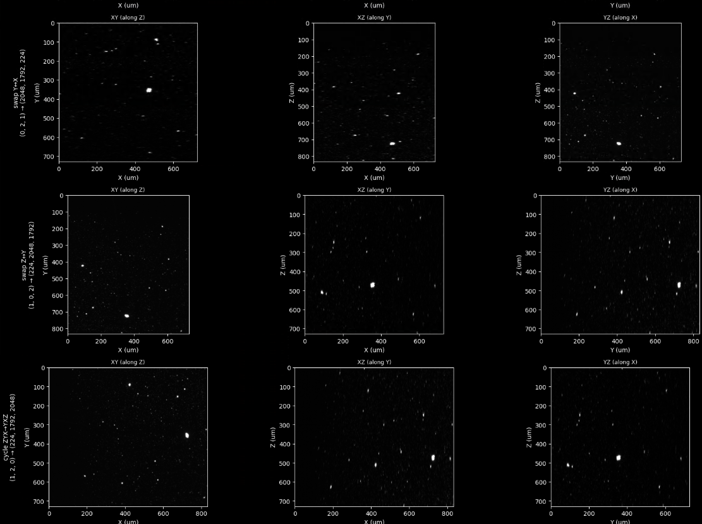
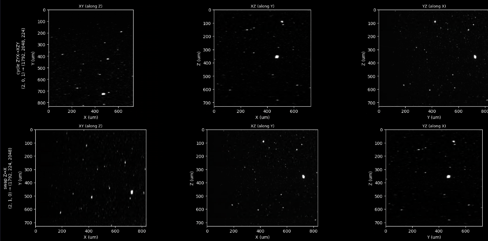

CM02 -> CM00 in Image J. 

- On CM02, "Reslice Top" -> Flip Vertically -> "Reslice left"

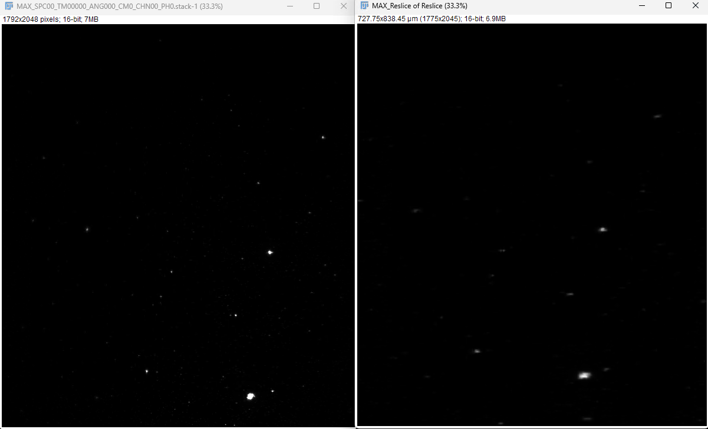

## In summary

The net permutation (Z,Y,X) → (X,Y,Z) with a flip is essentially just:

Reslice from Left, with "Flip vertically" checked

"Reslice from Left" takes columns (X axis) as the new slice direction: (Z,Y,X) → (X,Z,Y) ... not quite.
Let me actually verify by working out what each single Reslice does:

Reslice Top: new stack scans along Y → (Y, Z, X) — 2048 slices of 224×1792
Reslice Left: new stack scans along X → (X, Z, Y) — 1792 slices of 224×2048
Reslice Right: same as Left but reversed → (X, Z, Y) flipped
Hmm, none of these directly give (X, Y, Z) = (1792, 2048, 224) in one step. The two-reslice approach is needed because we're cycling all three axes, not just swapping two.

But there's a simpler way to describe it: "Rotate stack 90° around the Y axis, then flip vertically". ImageJ has Image > Transform > Rotate 90 Degrees Right/Left but that only rotates in the XY plane (within each slice), not around arbitrary axes.

So, 
1. Reslice from Top
2. Flip Vertically (2048 slices of 224×1792)
3. Reslice from Left: swaps which axis is "Z" vs "X" 
... or instead of another reslice, use the orthogonal planes with the orthogonal viewer.

So practically in ImageJ: Reslice from Top + Flip Vertically, then use the Orthogonal Views plugin to see the XZ plane if needed. Two steps instead of three.

### Updates

Camera pairs / cam-channel map now defaults, defined as globals in config.py

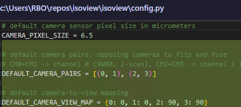
