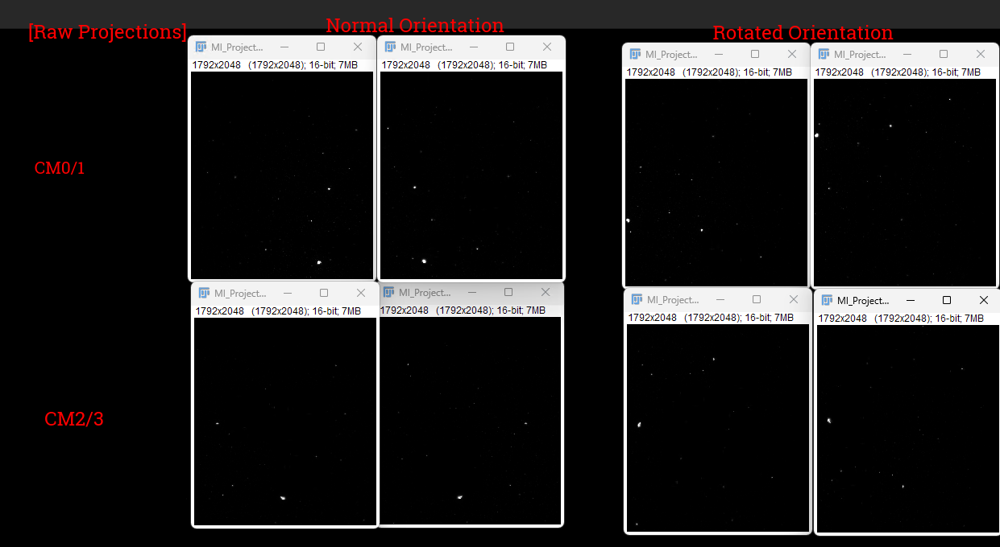
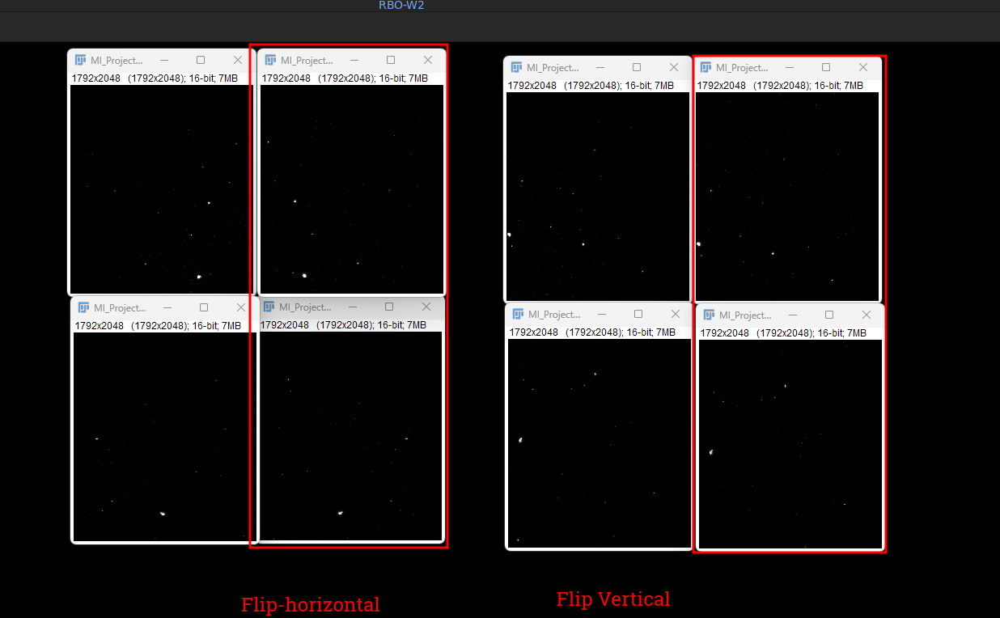

# Match CM02 to CM00 orientation (Y-scan to Z-scan)

## summary

Both orientations start with the same two steps: 
1. transpose Z/Y
2. flip Y.
3. (Rotated only) Transpose X/Z

The normal orientation needs one extra transpose at the end.

|   | normal orientation | rotated orientation (90 CCW) |
|---|---|---|
| **ImageJ** | Reslice (Top) > Flip Vertically > Reslice (Left) | Reslice (Top) > Flip Vertically |
| **numpy** | `v.transpose(1,0,2)` > `np.flip(v, 1)` > `v.transpose(2,0,1)` | `v.transpose(1,0,2)` > `np.flip(v, 1)` |
| **net permutation** | (Z,Y,X) > (X, Y, Z_flipped) | (Z,Y,X) > (Y, Z_flipped, X) |
| **output spacing (ZYX)** | (pixel_xy, pixel_xy, z_step) | (pixel_xy, z_step, pixel_xy) |

## imagej steps (detail)

### normal

1. `Image > Stacks > Reslice [/]...` start at Top
2. `Image > Transform > Flip Vertically`
3. `Image > Stacks > Reslice [/]...` start at Left

### rotated (90 CCW)

1. `Image > Stacks > Reslice [/]...` start at Top
2. `Image > Transform > Flip Vertically`

same as normal, without step 3.

## More orientation stuff

