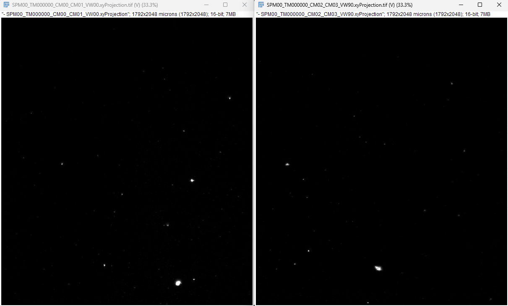
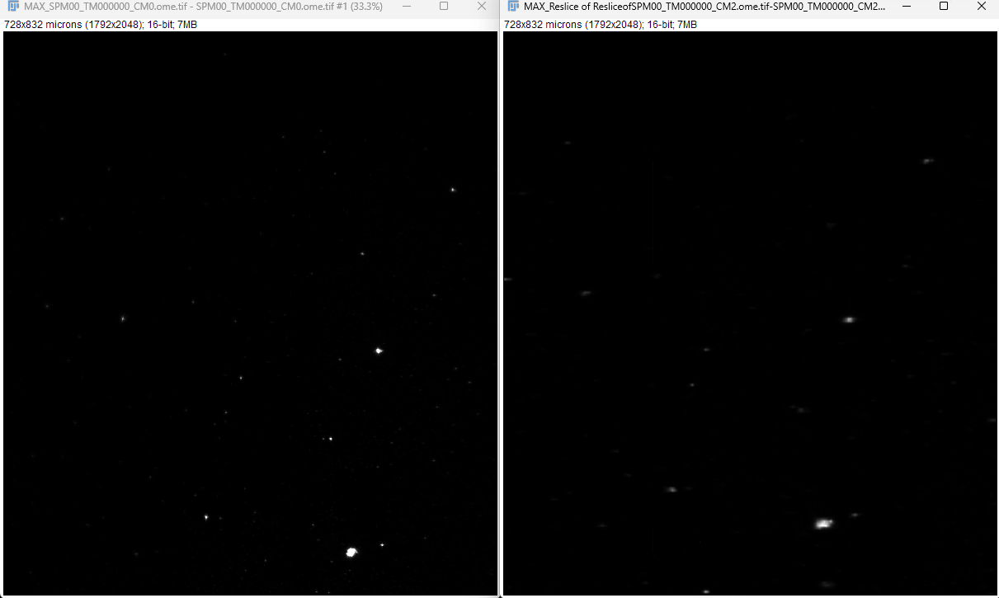
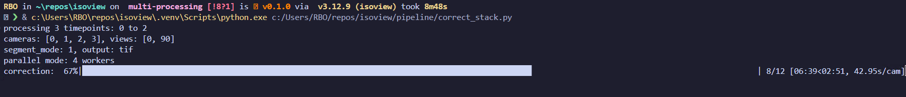

After multi-fuse NORMAL:



- Reslice (TOP), Flip V, Reslice (LEFT)



- Reslicing error when improper spacing is detected by OME-XML

NORMAL: Transforming CM02 -> CM00

```text

(Z,Y,X) → transpose(1,0,2) → (Y,Z,X)
         → flip Z axis      → (Y,Z_flipped,X)
         → transpose(2,0,1) → (X,Y,Z_flipped)

or 

result = np.flip(volume, axis=0).transpose(2, 1, 0)

```

## Dead Pixel Correction

Variance-std filter (lines 1030-1035):
- For each (x,y) pixel, compute its std across z → 2D map
- Median-filter that 2D map spatially (xy neighborhood) → what this pixel's std should look like based on its neighbors
- Flag pixels where `|pixel_std - neighbor_median_std|` exceeds an elbow threshold

Test 2 — Mean test (lines 1037-1042):
- For each (x,y) pixel, compute its mean across z, subtract background → 2D map
- Median-filter that spatially → expected mean based on neighbors
- Flag pixels where the relative difference |pixel_mean - neighbor_median_mean| / neighbor_median_mean exceeds an elbow threshold

Union of both → final bad-pixel mask (line 1044)

Correction (lines 1052-1056): for each z-slice independently, replace flagged pixel values with medfilt2 of that slice.

## Multiprocessing + progress bar


