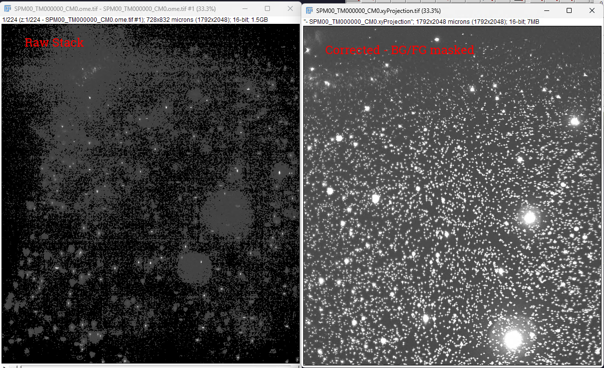

## Notes

IsoView Processing, background correction

1. Background tifs → dead pixel detection (clusterPT → processTimepoint)

- Background .tif files read from input folder
- 3rd percentile of each bg image computed as a scalar per camera
- Used only to normalize mean projections inside dead pixel detection
- Does not subtract from output data

2. Corner-region background estimation (localEC → clusterCS / correctStack)

- Samples a small region from a corner of the image (configurable: top-right, bottom-right, etc.)
- Computes mean() of that corner region per timepoint → intensityBackgrounds
- Saved to intensityBackgrounds.mat
- In correctStack.m, this value is actually subtracted from the image data, then multiplied by a scaling factor:
(readImage(...) - intensityBackgrounds(currentIndex)) .* intensityFactors(currentIndex)
- This is real background subtraction + intensity normalization across timepoints

3. Spatial high-pass filtering (clusterFR / filterResults)

- Subtracts a blurred copy of the image (median, box, or Gaussian)
- Removes slowly varying background, keeps fine structure
- No relation to background TIFs or dark frames

### Weekly meeting notes

- Fix the notes for what transpositions are needed
- Simplify CM02->CM00, find a more simple solution, find the transformation matrix
- Use the `2026-01-23_dresophila` dataset, 60 timepoints
  - moved old data to tmp, copy from Y/projects/isoview/python-pipeline/dresolphila to local
  - 99.9% sure it's rotated, double check
- Leslie:
- highres lbm stylet 
- isoview (2), gut 
- Sidney strickland, mouse
- Wills project
- Vaziri member (forgot name)
- Priya 
- Jarvis, functional-imaging singing mice
- Nat heintz, clear tissue 

- development office images
- Get some datasets, some images to beautify to pass along to them 
- 2/3 FOV recordings, mroi = 3 could be one
- Another mean projection (background), segmented masks from cellpose on the front overlayed
- cellpose + traces

### fg/bg is still being segmented in `correct_stack`

- 90 CCW around Y 
- TransformJ -> Rotate -90 Y

For rotated, +90 around X

[i'']   [0  0  1] [i]   [ 0  ]
[j''] = [0  1  0] [j] + [ 0  ]
[k'']   [-1 0  0] [k]   [Nz-1]

This is different than raghavs where the -1 and 1 are swapped in the matrix
     [ 0  0  1  0    ]
M =  [ 0  1  0  0    ]
     [-1  0  0  Nz-1 ]
Rows are ZYX output, columns are ZYX input + translation.

- Image Properties in .tif properties, pixel information

## Raghav comments

- digits in CM2, keep channel here, CHN01, remove the VW00 from XML
- use matrix, not transpose, for python outputs
