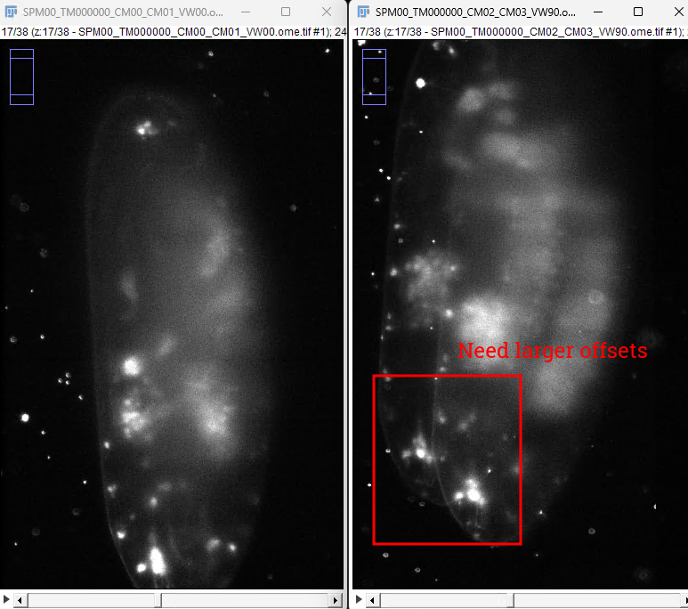
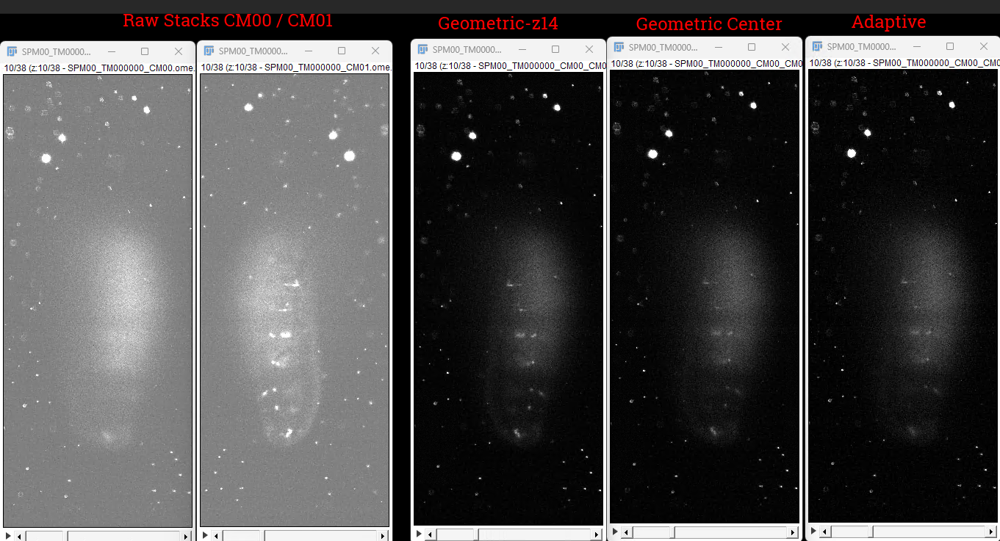
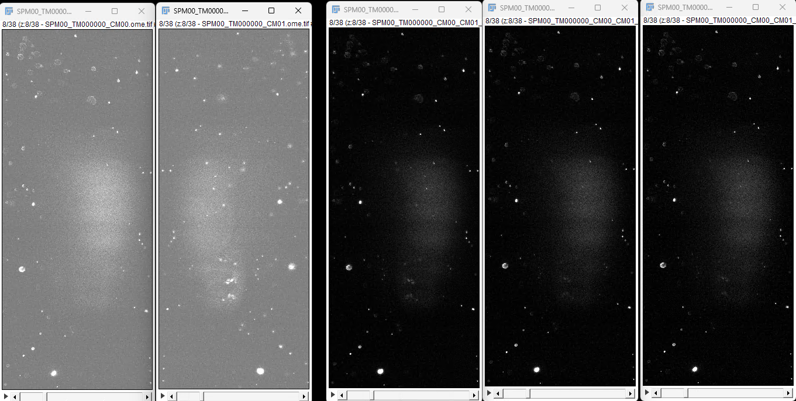
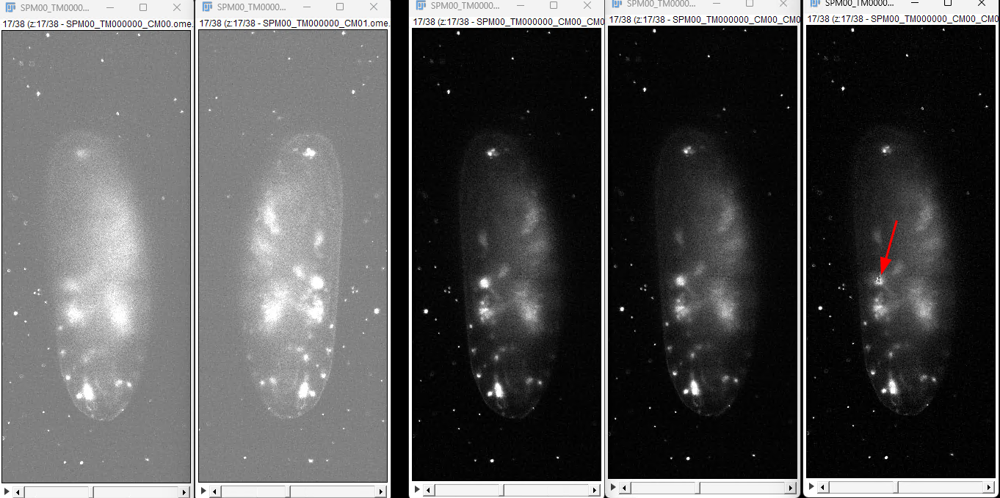
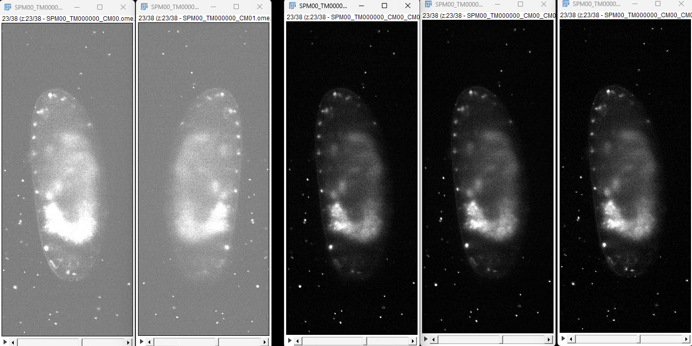
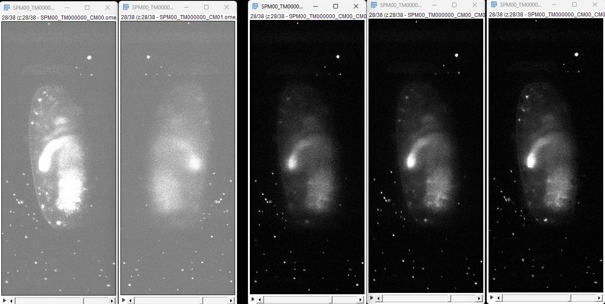

## Notes

-
## Dresophila dataset



Blending = 20 may be too wide, sharper transitions






 



 


```python
processing 61 timepoints: 0 to 60
cameras: [0, 1, 2, 3], views: [0, 90]
segment_mode: 1, output: tif                                                                                                                 
parallel mode: 16 workers                                                                                                                    
  TM000000 success (1.1s) [1/61]                                                                                                             
  TM000007 success (59.0s) [2/61]                                                                                                            
  TM000005 success (60.1s) [3/61]                                                                                                            
  TM000003 success (62.5s) [4/61]                                                                                                            
  TM000008 success (64.9s) [5/61]                                                                                                            
  TM000010 success (68.6s) [6/61]                                                                                                            
  TM000009 success (69.9s) [7/61]
  TM000014 success (70.1s) [8/61]
  TM000001 success (70.7s) [9/61]
  TM000002 success (70.7s) [10/61]
  TM000004 success (70.7s) [11/61]
  TM000006 success (70.6s) [12/61]
  TM000011 success (70.4s) [13/61]
  TM000012 success (70.4s) [14/61]
  TM000013 success (70.1s) [15/61]
  TM000015 success (70.4s) [16/61]
  TM000016 success (69.6s) [17/61]
  TM000017 success (62.1s) [18/61]
  TM000018 success (61.0s) [19/61]
  TM000019 success (58.7s) [20/61]
  TM000020 success (56.1s) [21/61]
  TM000021 success (54.1s) [22/61]
  TM000023 success (56.6s) [23/61]
  TM000024 success (56.7s) [24/61]
  TM000028 success (60.2s) [25/61]
  TM000022 success (62.4s) [26/61]
  TM000025 success (64.1s) [27/61]
  TM000030 success (65.7s) [28/61]
  TM000026 success (67.3s) [29/61]
  TM000027 success (67.0s) [30/61]
  TM000029 success (66.9s) [31/61]
  TM000031 success (67.0s) [32/61]
  TM000032 success (67.1s) [33/61]
  TM000035 success (62.8s) [34/61]
  TM000036 success (65.5s) [35/61]
  TM000037 success (64.9s) [36/61]
  TM000033 success (67.2s) [37/61]
  TM000039 success (61.7s) [38/61]
  TM000034 success (67.7s) [39/61]
  TM000038 success (61.9s) [40/61]
  TM000040 success (58.3s) [41/61]
  TM000041 success (56.5s) [42/61]
  TM000042 success (56.1s) [43/61]
  TM000043 success (55.9s) [44/61]
  TM000044 success (62.9s) [45/61]
  TM000046 success (65.3s) [46/61]
  TM000045 success (65.8s) [47/61]
  TM000047 success (65.7s) [48/61]
  TM000048 success (66.8s) [49/61]
  TM000049 success (49.0s) [50/61]
  TM000050 success (49.9s) [51/61]
  TM000051 success (50.1s) [52/61]
  TM000052 success (56.0s) [53/61]
  TM000053 success (55.5s) [54/61]
  TM000054 success (55.5s) [55/61]
  TM000055 success (55.1s) [56/61]
  TM000056 success (54.9s) [57/61]
  TM000057 success (55.1s) [58/61]
  TM000058 success (53.3s) [59/61]
  TM000059 success (52.0s) [60/61]
  TM000060 success (46.1s) [61/61]
```

## Registration offsets

Start, Stop, Step

- Should use the first timepoint to seed remaining timepoints
- Not every timepoint needs a thorough search like below
- Could output a figure in `correct_stack` to inform how many pixels are needed

search_offsets_x=(-200, 250, 10),           # (default=(-50,50,10)) x search range (start, stop, step)
search_offsets_y=(-250, 250, 10),         # (default=(-50,50,10)) y search range (start, stop, step)
