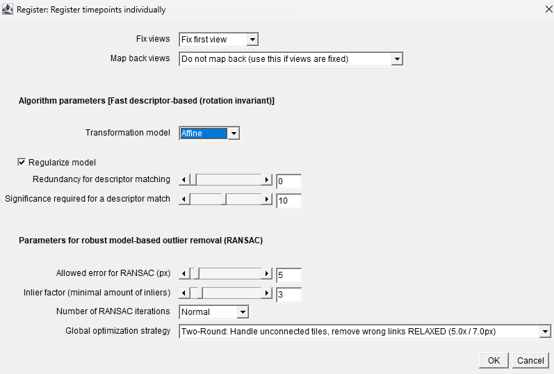
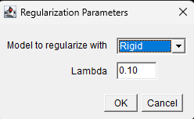
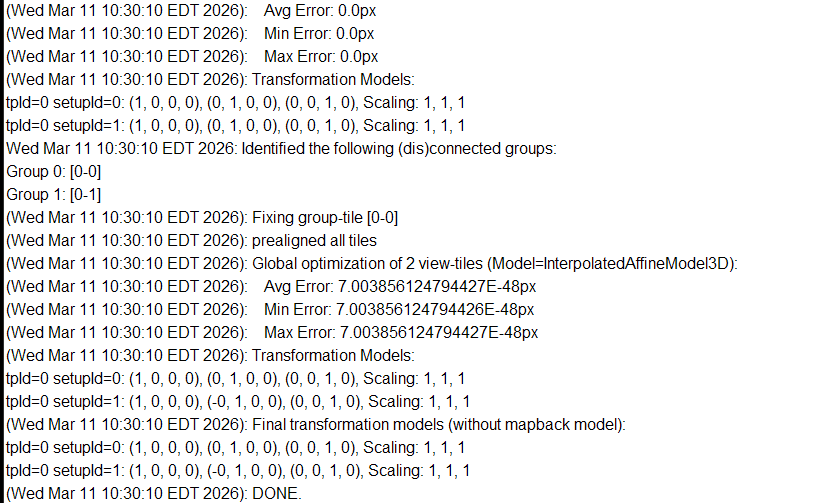
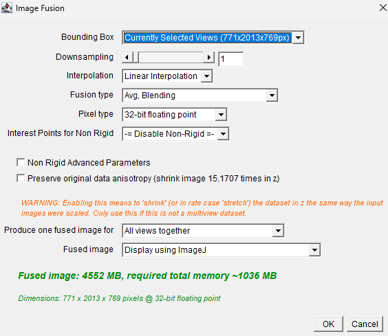
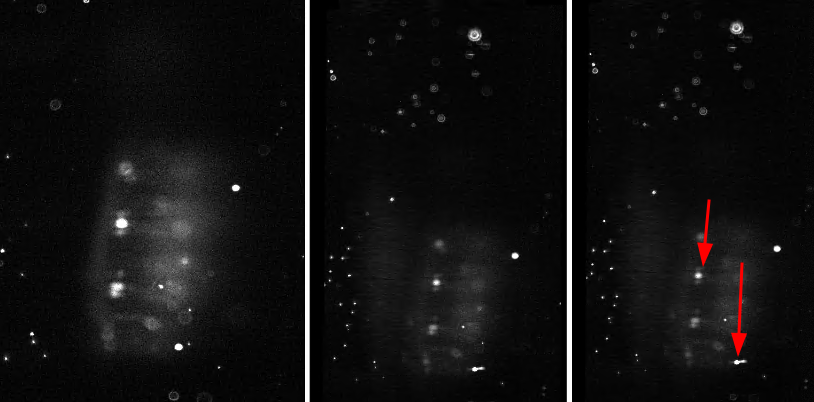
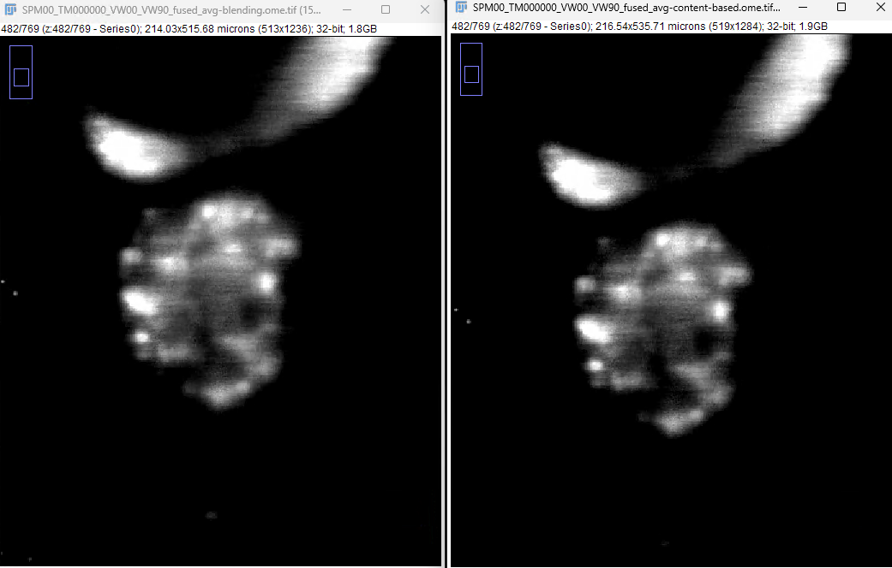

## VW90 -> VW00 Registration

### BigStitcher

#### Alignment 

1. Load multi-pyramid OME-TIFF
1a. Resave highest resolution pyramid
2. BigStitcher -> Create New Dataset -> No Angle Rotation
3. Start manual transform (T) -> Rotate around X (shift+X)
4. Align Z-planes via manual transorm in X, Y and Z planes
5. Align XY spatially in X, Y and Z planes
6. Bake BDV transform

#### Registration

1. Detect Interest Points (all defaults)
- 3D quadratic fit
- Match Z-resolution + 1x downsample Z
- Sigma 1.8, threshold 0.008, Find DoG maxima only

```text
  (Wed Mar 11 10:26:44 EDT 2026): min intensity = 0.0, max intensity = 178.0
  (Wed Mar 11 10:26:44 EDT 2026): computing DoG with (sigma=1.8, threshold=0.008, sigma1=(1.7291616201400757, 1.7291616201400757, 1.7291616201400757), sigma2=(2.0813581943511963, 2.0813581943511963, 2.0813581943511963))
  (Wed Mar 11 10:26:44 EDT 2026): Detecting peaks.
  (Wed Mar 11 10:26:45 EDT 2026): Found 2193 initial peaks (before refinement).
  (Wed Mar 11 10:26:45 EDT 2026): Quadratic localization.
  (Wed Mar 11 10:26:45 EDT 2026): Subpixel localization using quadratic n-dimensional fit
  (Wed Mar 11 10:26:45 EDT 2026): Found 956 final peaks.
  (Wed Mar 11 10:26:45 EDT 2026): Correcting coordinates for downsampling using AffineTransform: 3d-affine: (8.0, 0.0, 0.0, 3.5, 0.0, 8.0, 0.0, 3.5, 0.0, 0.0, 1.0, 0.0)
  (Wed Mar 11 10:26:45 EDT 2026): min intensity = 0.0, max intensity = 178.0
  (Wed Mar 11 10:26:45 EDT 2026): computing DoG with (sigma=1.8, threshold=0.008, sigma1=(1.7291616201400757, 1.7291616201400757, 1.7291616201400757), sigma2=(2.0813581943511963, 2.0813581943511963, 2.0813581943511963))
  (Wed Mar 11 10:26:45 EDT 2026): Detecting peaks.
  (Wed Mar 11 10:26:45 EDT 2026): Found 2205 initial peaks (before refinement).
  (Wed Mar 11 10:26:45 EDT 2026): Quadratic localization.
  (Wed Mar 11 10:26:45 EDT 2026): Subpixel localization using quadratic n-dimensional fit
  (Wed Mar 11 10:26:45 EDT 2026): Found 898 final peaks.
  (Wed Mar 11 10:26:45 EDT 2026): Correcting coordinates for downsampling using AffineTransform: 3d-affine: (8.0, 0.0, 0.0, 3.5, 0.0, 8.0, 0.0, 3.5, 0.0, 0.0, 1.0, 0.0)
  (Wed Mar 11 10:26:45 EDT 2026): DONE.

```
2. Register using interest points (all defaults)







- Fail

2a. Fast descriptor based (translation invariant)

- Fail

2b. Precise descriptor based (translation invariant)

- Success

```text
By default #fixed views for strategy IndividualTimepoints = 0
Removed 0 views due to fixing all views (in total 1)
(Wed Mar 11 10:35:46 EDT 2026): [TP=0 ViewId=0 Label=beads >>> TP=0 ViewId=1 Label=beads]: Remaining inliers after RANSAC: 42 of 84 (50%) with average error 3.380508282809333
Connecting tpId=0 setupId=0 (beads) <-> tpId=0 setupId=1 (beads): 42 matches, |w|=1.0
(Wed Mar 11 10:35:46 EDT 2026): Fixing view-tile [tpId=0 setupId=0]
(Wed Mar 11 10:35:46 EDT 2026): prealigned all tiles
(Wed Mar 11 10:35:46 EDT 2026): Global optimization of 2
(Wed Mar 11 10:35:46 EDT 2026):    Avg Error: 3.271289893909776px
(Wed Mar 11 10:35:46 EDT 2026):    Min Error: 3.271289893909776px
(Wed Mar 11 10:35:46 EDT 2026):    Max Error: 3.271289893909776px
(Wed Mar 11 10:35:46 EDT 2026): Transformation Models:
tpId=0 setupId=0: (1, 0, 0, 0), (0, 1, 0, 0), (0, 0, 1, 0), Scaling: 1, 1, 1
tpId=0 setupId=1: (0.9657, -0.0076, 0.0264, 8.9969), (-0.0181, 0.9988, -0.0235, 13.8611), (0.0187, 0.0027, 0.9345, 18.3938), Scaling: 0.966, 0.9988, 0.9352
Wed Mar 11 10:35:46 EDT 2026: Not more than one group left after first round of global opt (all views are connected), this means we are already done.
(Wed Mar 11 10:35:46 EDT 2026): Final transformation models (without mapback model):
tpId=0 setupId=0: (1, 0, 0, 0), (0, 1, 0, 0), (0, 0, 1, 0), Scaling: 1, 1, 1
tpId=0 setupId=1: (0.9657, -0.0076, 0.0264, 8.9969), (-0.0181, 0.9988, -0.0235, 13.8611), (0.0187, 0.0027, 0.9345, 18.3938), Scaling: 0.966, 0.9988, 0.9352
(Wed Mar 11 10:35:46 EDT 2026): DONE.
```

3. Fuse Images (all defaults)



3a. FusionType: Avg, Content Based

- Took significantly longer, ~3min vs 10 seconds for avg-fusion

3b. FusionType: Avg, Blending & Content Based

- Took over an hour

### Validation

VW00, VW90, Avg-fusion, Avg-content based fusion


![[dresophila_corrected_fused.mp4]]


