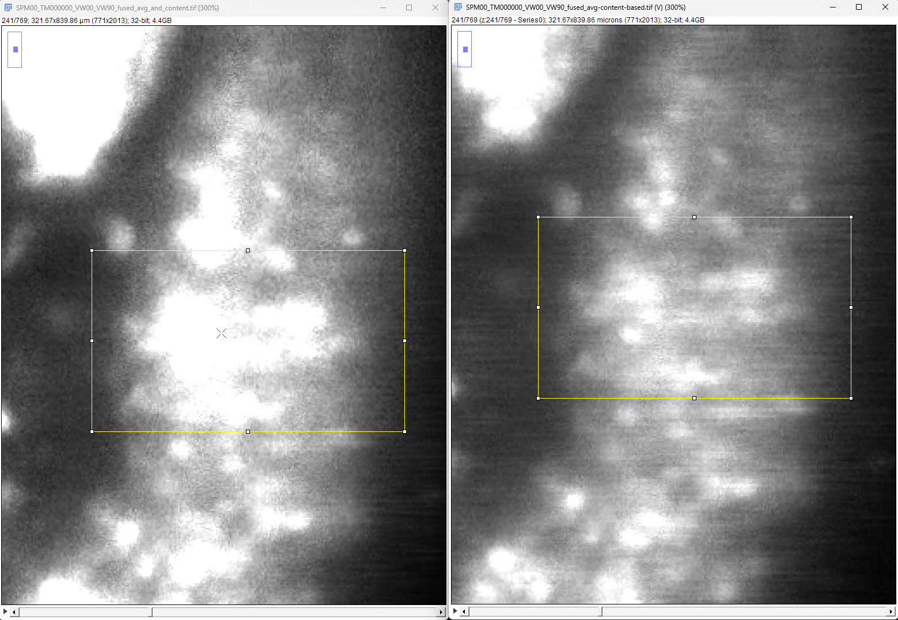

## Notes

- Pollen calibration: note that figures / h5 file are auto-generated (see C1_DATA pollen, somewhere on C1)

- mbo_utilities is more stable for will, continuing onto last weeks tasks

These are priorities we talked about
- add mbo-utilities to RBO-C1 
widdle down next week, do the RBO-C1 stuff, cellpose, fuse views and try on that, then move 
- fiji 1.54r
- java21.0.7
- update latest java
- disable java8
Try BDV fusion with new fiji version

## Register with BDV

Fiji > Plugins > BigStitcher > General > Define MultiView Dataset Automatic Loader (Bioformats based)

Already did this, comparing fused outputs:

