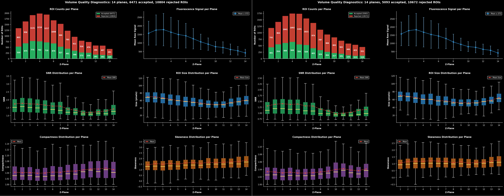
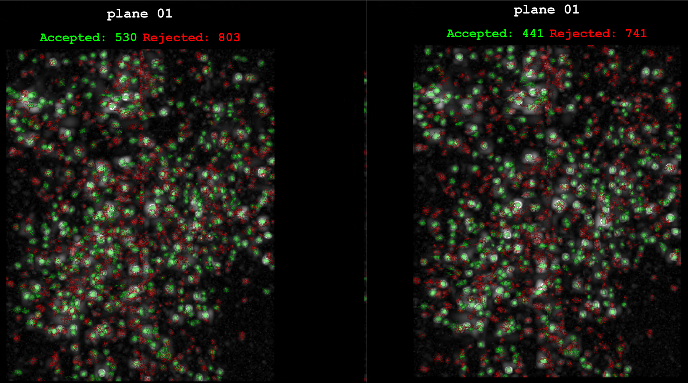
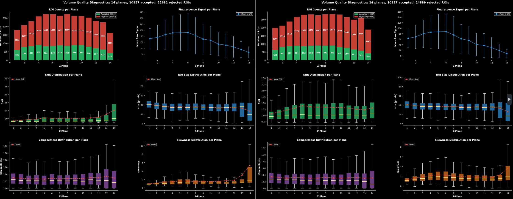
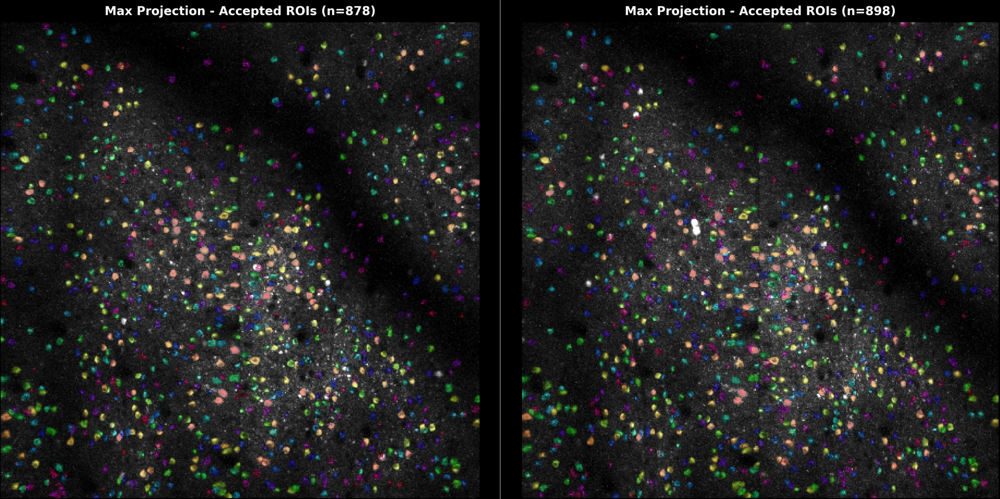
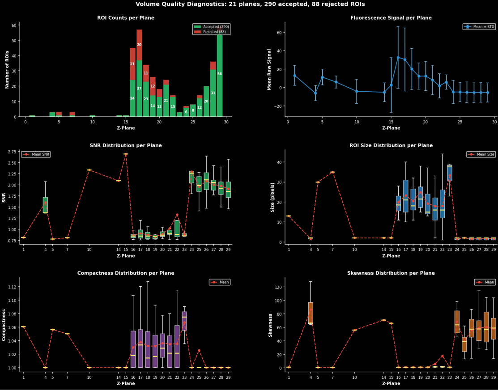
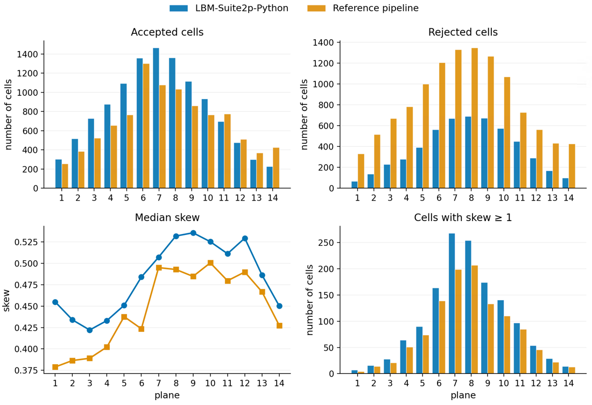

## Notes

- Averaging 14hz -> 4hz (`Y:\projects\lbm\2026-05-05_frame-averaging-17hz-to-4hz-s2p`)
    - Demo dataset: kbarber mk355 2025-07-17
        - 4hz   (393 timepoints) = 6471 acc / 10804 rej
        - 17hz (1574 timepoints) = 5093 acc / 10672 rej
    - wsnyder newest dataset
        - 17hz (6979 timepoints) = 10857 acc / 22682 rej
        - 4hz  (1744 timepoints) = 10837 acc / 24899 rej
- Kevins suite2p run vs MBO suite2p (`X:\lbm\kbarber\2025-03-13-mk301\pipeline_compare`)
    - MBO-Suite2p (sparsery): More accepted cells, less rejected cells, higher median skew, more cells with skew >= 1, more visually accurate
    - Very slightly degraded registration via frame-by-frame correlation
    - Kevin used normcorre -> sutie2p 2 step registration (3 rounds)

Kbarber

left = all timepoints, right = averaged to ~4hz

wsynder

left = all timepoints, right = averaged to ~4hz

Kevins low-quality recording:

- A recording Kevin has tried to include but has been unable to get reasonable traces for
- Said this was "so much better" than his previous attempt, I believe hes adding to his dataset
- Included notebook is useful for how users can process multi-ROI's separately (e.g. concatenate roi 1 + 2, separately concatenate roi 3 + 4)

Kevins suite2p run vs MBO suite2p run:

