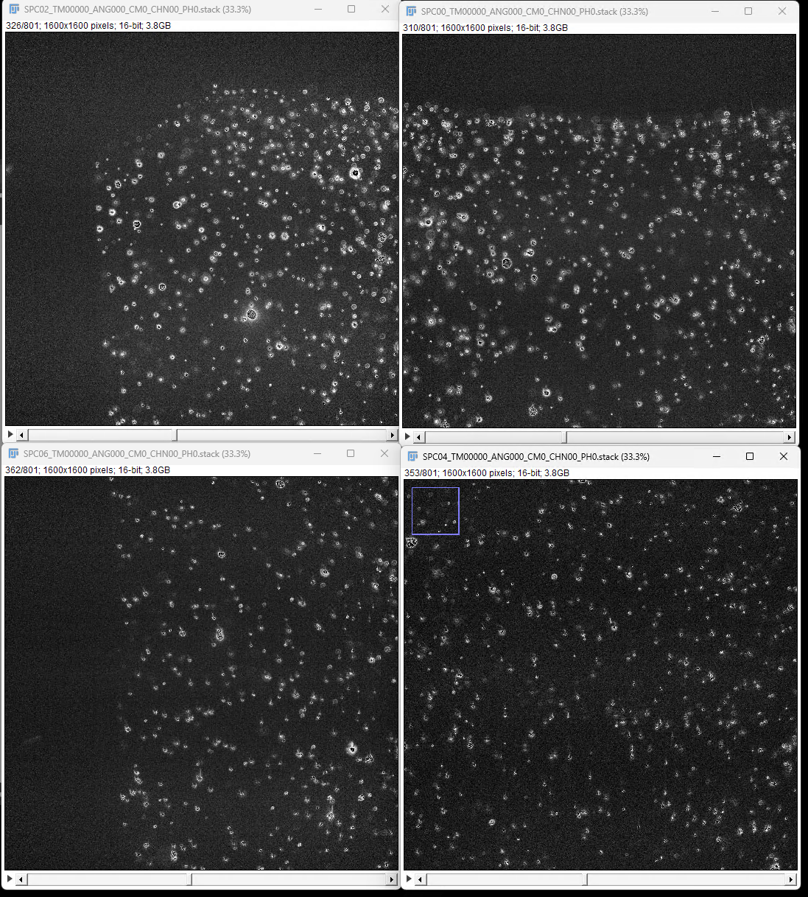
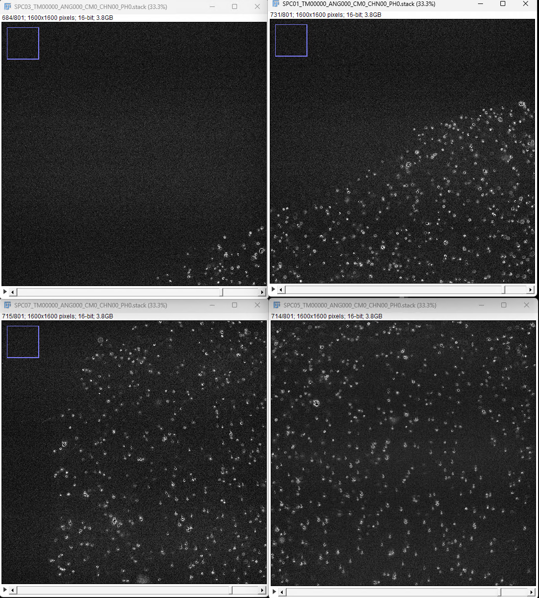
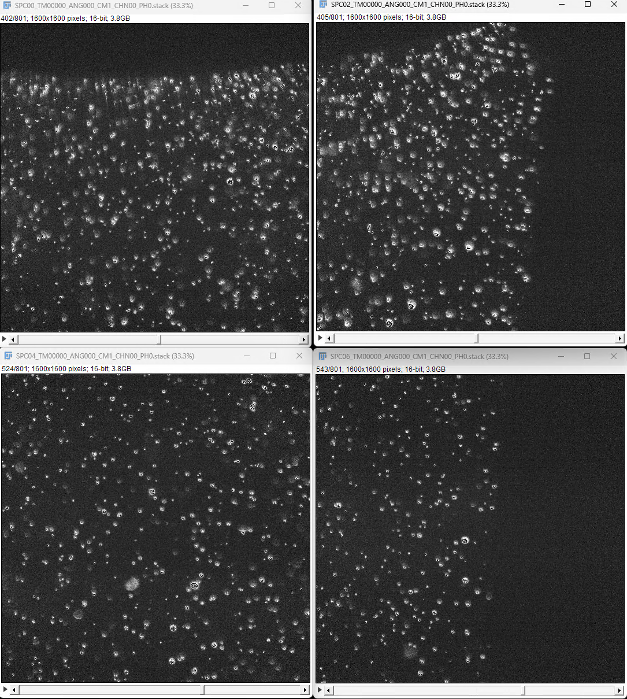

# Tiled (normal):

## Camera 00

┌───────┬──────────┬────────────┬──────────────────────────────────────────┐
│ tile  │ specimen │ stage X, Y │         stack to open (camera 0)         │
├───────┼──────────┼────────────┼──────────────────────────────────────────┤
│ TL000 │ SPC00    │ 1100, 1300 │ SPC00_TM00000_ANG000_CM0_CHN00_PH0.stack │
├───────┼──────────┼────────────┼──────────────────────────────────────────┤
│ TL010 │ SPC02    │ 1100, 1900 │ SPC02_TM00000_ANG000_CM0_CHN00_PH0.stack │
├───────┼──────────┼────────────┼──────────────────────────────────────────┤
│ TL100 │ SPC04    │ 1700, 1300 │ SPC04_TM00000_ANG000_CM0_CHN00_PH0.stack │
├───────┼──────────┼────────────┼──────────────────────────────────────────┤
│ TL110 │ SPC06    │ 1700, 1900 │ SPC06_TM00000_ANG000_CM0_CHN00_PH0.stack │
└───────┴──────────┴────────────┴──────────────────────────────────────────┘

<- +Y

┌───────┬──────────┬────────────┬──────────────────────────────────────────┐
│ tile  │ specimen │ stage X, Y │         stack to open (camera 0)         │
├───────┼──────────┼────────────┼──────────────────────────────────────────┤
│ TL001 │ SPC01    │ 1100, 1300 │ SPC01_TM00000_ANG000_CM0_CHN00_PH0.stack │
├───────┼──────────┼────────────┼──────────────────────────────────────────┤
│ TL011 │ SPC03    │ 1100, 1900 │ SPC03_TM00000_ANG000_CM0_CHN00_PH0.stack │
├───────┼──────────┼────────────┼──────────────────────────────────────────┤
│ TL101 │ SPC05    │ 1700, 1300 │ SPC05_TM00000_ANG000_CM0_CHN00_PH0.stack │
├───────┼──────────┼────────────┼──────────────────────────────────────────┤
│ TL111 │ SPC07    │ 1700, 1900 │ SPC07_TM00000_ANG000_CM0_CHN00_PH0.stack │
└───────┴──────────┴────────────┴──────────────────────────────────────────┘

## Camera 01

┌───────┬──────────┬────────────┬──────────────────────────────────────────┐
│ tile  │ specimen │ stage X, Y │         stack to open (camera 1)         │
├───────┼──────────┼────────────┼──────────────────────────────────────────┤
│ TL000 │ SPC00    │ 1100, 1300 │ SPC00_TM00000_ANG000_CM1_CHN00_PH0.stack │
│ TL010 │ SPC02    │ 1100, 1900 │ SPC02_TM00000_ANG000_CM1_CHN00_PH0.stack │
│ TL100 │ SPC04    │ 1700, 1300 │ SPC04_TM00000_ANG000_CM1_CHN00_PH0.stack │
│ TL110 │ SPC06    │ 1700, 1900 │ SPC06_TM00000_ANG000_CM1_CHN00_PH0.stack │
└───────┴──────────┴────────────┴──────────────────────────────────────────┘

## BigStitcher orientations

┌────────┬────────────────────────────┬──────────────┐
│ camera │           affine           │   meaning    │
├────────┼────────────────────────────┼──────────────┤
│ CM00   │ identity                   │ reference    │
├────────┼────────────────────────────┼──────────────┤
│ CM01   │ diag(−1, 1, 1)             │ mirror X     │
├────────┼────────────────────────────┼──────────────┤
│ CM02   │ [[0,0,1],[0,1,0],[−1,0,0]] │ +90° about Y │
├────────┼────────────────────────────┼──────────────┤
│ CM03   │ [[0,0,1],[0,1,0],[1,0,0]]  │ swap X↔Z     │
└────────┴────────────────────────────┴──────────────┘

## BigStitcher with zarr v3

Using spimdata version: 0.9-revision
Using multiview-reconstruction version: reconstruction-9.0.0-SNAPSHOT
Trying to parse ''
Mon Jun 22 13:55:32 EDT 2026: Investigating file D:\2025-06-22_test-bigstitcher-zarrv3\SPM00_TL1_CM00_CM01_CHN00.fusedStack.ome.tif
Mon Jun 22 13:55:32 EDT 2026: Detecting Tiles and Angles in Series 1 of 1
Mon Jun 22 13:55:32 EDT 2026: Detecting Channels and Illuminations in Series 1 of 1
Mon Jun 22 13:55:32 EDT 2026: Investigating file D:\2025-06-22_test-bigstitcher-zarrv3\SPM00_TL1_CM02_CM03_CHN01.fusedStack.ome.tif
Mon Jun 22 13:55:32 EDT 2026: Detecting Tiles and Angles in Series 1 of 1
Mon Jun 22 13:55:32 EDT 2026: Detecting Channels and Illuminations in Series 1 of 1
Finalizing ViewSetup: 0
Found View: ch0 a0 ti0 tp0 i0 in file D:\2025-06-22_test-bigstitcher-zarrv3\SPM00_TL1_CM00_CM01_CHN00.fusedStack.ome.tif
Finalizing ViewSetup: 1
Found View: ch0 a1 ti0 tp0 i0 in file D:\2025-06-22_test-bigstitcher-zarrv3\SPM00_TL1_CM02_CM03_CHN01.fusedStack.ome.tif
XML & metadata path: file:/D:/2025-06-22_test-bigstitcher-zarrv3/
XML: file:/D:/2025-06-22_test-bigstitcher-zarrv3/dataset.xml
Image data path: file:/D:/2025-06-22_test-bigstitcher-zarrv3/
Mon Jun 22 13:56:11 EDT 2026: Checking file sizes ... 
Mon Jun 22 13:56:11 EDT 2026: Checking z size in file: D:\2025-06-22_test-bigstitcher-zarrv3\SPM00_TL1_CM00_CM01_CHN00.fusedStack.ome.tif, series 0
Mon Jun 22 13:56:11 EDT 2026: Corrected size is 494 (was 494)
Mon Jun 22 13:56:11 EDT 2026: Checking z size in file: D:\2025-06-22_test-bigstitcher-zarrv3\SPM00_TL1_CM02_CM03_CHN01.fusedStack.ome.tif, series 0
Mon Jun 22 13:56:11 EDT 2026: Corrected size is 494 (was 494)
Mon Jun 22 13:56:11 EDT 2026: Finished.
OME-Zarr v3 path: file:/D:/2025-06-22_test-bigstitcher-zarrv3/dataset.ome.zarr
Mon Jun 22 13:56:21 EDT 2026: Saving file:/D:/2025-06-22_test-bigstitcher-zarrv3/dataset.ome.zarr
Downsamplings: [[1, 1, 1], [2, 2, 1], [4, 4, 2], [8, 8, 4]]
Creating 5D OME-ZARR metadata for 's1-t0.zarr/' ... 
Creating 5D OME-ZARR metadata for 's0-t0.zarr/' ... 
Created BDV-metadata, took: 78 ms.
Number of compute blocks (s0): 16
Blocks remaining for retry in s0 resaving tp=0 setup=0: 0
Blocks remaining for retry in s0 resaving tp=0 setup=1: 0
Saved level s0, took: 638697 ms.
Downsampling level s1... 
Number of compute blocks (s1): 16
Blocks remaining for retry in s1 resaving: 0
Resaved ZARR s1 level, took: 4996 ms.
Downsampling level s2... 
Number of compute blocks (s2): 8
Blocks remaining for retry in s2 resaving: 0
Resaved ZARR s2 level, took: 969 ms.
Downsampling level s3... 
Number of compute blocks (s3): 4
Blocks remaining for retry in s3 resaving: 0
Resaved ZARR s3 level, took: 169 ms.
Mon Jun 22 14:07:06 EDT 2026: Finished saving file:/D:/2025-06-22_test-bigstitcher-zarrv3/dataset.ome.zarr
(Mon Jun 22 14:07:06 EDT 2026): OME-Zarr v3 resave finished.
Saving interest points multi-threaded (32 threads) ... 
Saving PSFs multi-threaded (32 threads) ... 
(Mon Jun 22 14:07:06 EDT 2026): Saved xml 'file:/D:/2025-06-22_test-bigstitcher-zarrv3/dataset.xml'.
PERF: [elements()] getFilteredViewDescriptions took 1 ms, got 2 views
PERF: [combineOrSplitBy] sort 2 vds took 0 ms
PERF: [combineOrSplitBy] grouping loop took 0 ms, created 2 groups
PERF: [combineOrSplitBy] TOTAL took 0 ms
PERF: [elements()] Group.combineBy took 0 ms, got 2 groups
PERF: [elements()] sorting took 1 ms
PERF: [elements()] TOTAL took 2 ms
PERF: [elements()] getFilteredViewDescriptions took 0 ms, got 1 views
PERF: [combineOrSplitBy] sort 1 vds took 0 ms
PERF: [combineOrSplitBy] grouping loop took 2 ms, created 1 groups
PERF: [combineOrSplitBy] TOTAL took 2 ms
PERF: [elements()] Group.combineBy took 2 ms, got 1 groups
PERF: [elements()] sorting took 0 ms
PERF: [elements()] TOTAL took 2 ms
PERF: [combineOrSplitBy] sort 2 vds took 0 ms
PERF: [combineOrSplitBy] grouping loop took 0 ms, created 1 groups
PERF: [combineOrSplitBy] TOTAL took 0 ms
PERF: [combineOrSplitBy] sort 2 vds took 0 ms
PERF: [combineOrSplitBy] grouping loop took 0 ms, created 1 groups
PERF: [combineOrSplitBy] TOTAL took 0 ms
PERF: [combineOrSplitBy] sort 2 vds took 0 ms
PERF: [combineOrSplitBy] grouping loop took 0 ms, created 2 groups
PERF: [combineOrSplitBy] TOTAL took 0 ms
Defining grid for Angle 1 of 2
PERF: [elements()] getFilteredViewDescriptions took 0 ms, got 1 views
PERF: [combineOrSplitBy] sort 1 vds took 0 ms
PERF: [combineOrSplitBy] grouping loop took 0 ms, created 1 groups
PERF: [combineOrSplitBy] TOTAL took 0 ms
PERF: [elements()] Group.combineBy took 0 ms, got 1 groups
PERF: [elements()] sorting took 0 ms
PERF: [elements()] TOTAL took 0 ms
PERF: [combineOrSplitBy] sort 2 vds took 1 ms
PERF: [combineOrSplitBy] grouping loop took 0 ms, created 1 groups
PERF: [combineOrSplitBy] TOTAL took 1 ms
PERF: [combineOrSplitBy] sort 2 vds took 0 ms
PERF: [combineOrSplitBy] sort 2 vds took 0 ms
PERF: [combineOrSplitBy] grouping loop took 0 ms, created 1 groups
PERF: [combineOrSplitBy] TOTAL took 0 ms
PERF: [combineOrSplitBy] grouping loop took 0 ms, created 1 groups
PERF: [combineOrSplitBy] TOTAL took 0 ms
PERF: [combineOrSplitBy] sort 2 vds took 0 ms
PERF: [combineOrSplitBy] grouping loop took 0 ms, created 1 groups
PERF: [combineOrSplitBy] TOTAL took 0 ms
Defining grid for Angle 2 of 2
PERF: [elements()] getFilteredViewDescriptions took 0 ms, got 1 views
PERF: [combineOrSplitBy] sort 1 vds took 0 ms
PERF: [combineOrSplitBy] grouping loop took 0 ms, created 1 groups
PERF: [combineOrSplitBy] TOTAL took 0 ms
PERF: [elements()] Group.combineBy took 0 ms, got 1 groups
PERF: [elements()] sorting took 0 ms
PERF: [elements()] TOTAL took 0 ms
Only one tile, starting in MultiView mode.
PERF: [ViewSetupExplorerPanel] initPopups() took 1 ms
PERF: [elements()] getFilteredViewDescriptions took 0 ms, got 2 views
PERF: [combineOrSplitBy] sort 2 vds took 0 ms
PERF: [combineOrSplitBy] grouping loop took 0 ms, created 2 groups
PERF: [combineOrSplitBy] TOTAL took 0 ms
PERF: [elements()] Group.combineBy took 0 ms, got 2 groups
PERF: [elements()] sorting took 0 ms
PERF: [elements()] TOTAL took 0 ms
PERF: [elements()] getFilteredViewDescriptions took 0 ms, got 2 views
PERF: [combineOrSplitBy] sort 2 vds took 0 ms
PERF: [combineOrSplitBy] grouping loop took 0 ms, created 2 groups
PERF: [combineOrSplitBy] TOTAL took 0 ms
PERF: [elements()] Group.combineBy took 0 ms, got 2 groups
PERF: [elements()] sorting took 0 ms
PERF: [elements()] TOTAL took 0 ms
Saved selection to history (1/1)
PERF: [ViewSetupExplorerPanel] initComponent() took 12 ms
PERF: [whiteSourcesBatch] set 2 sources to white in 0 ms
PERF: [setVisibleSourcesBatch] deactivated 1, activated 1 sources

Worker starting (pid=53344)
13:30:17 | mbo.worker             | INFO    | Worker started: task=isoview_bigstitcher, pid=53344
13:30:17 | mbo.worker             | INFO    | generate_bigstitcher_xml: input=D:\2026-06-18_194nm.Beads_8Tiles-Camera-Orientations\Beads_Normal-Orientation_8Tiles_20260618_153833, fused_dir=D:\2026-06-18_194nm.Beads_8Tiles-Camera-Orientations\Beads_Normal-Orientation_8Tiles_20260618_153833.fused, stitcher_dir=D:\2026-06-18_194nm.Beads_8Tiles-Camera-Orientations\Beads_Normal-Orientation_8Tiles_20260618_153833.stitcher
13:30:17 | isoview.views          | INFO    | exporting method None: 32 pair(s)
13:30:17 | isoview.views          | INFO    | calibration: px=0.40625 um, zs=0.812 um, Z anisotropy factor=1.998769
13:30:21 | mbo.worker             | INFO    | mem 61.1% 78.0/127.8 GB | pipeline 11.56 GB/1 proc, top 53344 pythonw.exe 11.56 GB
13:30:33 | mbo.worker             | INFO    | mem 67.1% 85.8/127.8 GB | pipeline 19.20 GB/1 proc, top 53344 pythonw.exe 19.20 GB
13:30:41 | mbo.worker             | INFO    | mem 70.1% 89.5/127.8 GB | pipeline 23.02 GB/1 proc, top 53344 pythonw.exe 23.02 GB
13:30:49 | mbo.worker             | INFO    | mem 73.1% 93.4/127.8 GB | pipeline 26.84 GB/1 proc, top 53344 pythonw.exe 26.84 GB
13:31:25 | isoview.views          | INFO    | wrote s0-t0.zarr (801, 1600, 1600)
13:31:57 | mbo.worker             | INFO    | mem 76.0% 97.2/127.8 GB | pipeline 30.22 GB/1 proc, top 53344 pythonw.exe 30.22 GB
13:32:31 | isoview.views          | INFO    | wrote s1-t0.zarr (801, 1600, 1600)
13:33:37 | isoview.views          | INFO    | wrote s2-t0.zarr (801, 1600, 1600)
13:34:44 | isoview.views          | INFO    | wrote s3-t0.zarr (801, 1600, 1600)
13:35:50 | isoview.views          | INFO    | wrote s4-t0.zarr (801, 1600, 1600)
13:37:02 | isoview.views          | INFO    | wrote s5-t0.zarr (801, 1600, 1600)
13:38:09 | isoview.views          | INFO    | wrote s6-t0.zarr (801, 1600, 1600)
13:39:20 | isoview.views          | INFO    | wrote s7-t0.zarr (801, 1600, 1600)
13:40:31 | isoview.views          | INFO    | wrote s8-t0.zarr (801, 1600, 1600)
13:41:41 | isoview.views          | INFO    | wrote s9-t0.zarr (801, 1600, 1600)
13:42:16 | mbo.worker             | INFO    | mem 75.4% 96.3/127.8 GB | pipeline 31.02 GB/1 proc, top 53344 pythonw.exe 31.02 GB
13:42:53 | isoview.views          | INFO    | wrote s10-t0.zarr (801, 1600, 1600)
13:44:04 | isoview.views          | INFO    | wrote s11-t0.zarr (801, 1600, 1600)
13:45:14 | isoview.views          | INFO    | wrote s12-t0.zarr (801, 1600, 1600)
13:45:48 | mbo.worker             | INFO    | mem 72.9% 93.2/127.8 GB | pipeline 31.13 GB/1 proc, top 53344 pythonw.exe 31.13 GB
13:46:25 | isoview.views          | INFO    | wrote s13-t0.zarr (801, 1600, 1600)
13:47:38 | isoview.views          | INFO    | wrote s14-t0.zarr (801, 1600, 1600)
13:48:49 | isoview.views          | INFO    | wrote s15-t0.zarr (801, 1600, 1600)
13:50:01 | isoview.views          | INFO    | wrote s16-t0.zarr (801, 1600, 1600)
13:51:14 | isoview.views          | INFO    | wrote s17-t0.zarr (801, 1600, 1600)
13:52:26 | isoview.views          | INFO    | wrote s18-t0.zarr (801, 1600, 1600)
13:53:39 | isoview.views          | INFO    | wrote s19-t0.zarr (801, 1600, 1600)
13:54:51 | isoview.views          | INFO    | wrote s20-t0.zarr (801, 1600, 1600)
13:56:02 | isoview.views          | INFO    | wrote s21-t0.zarr (801, 1600, 1600)
13:57:54 | isoview.views          | INFO    | wrote s22-t0.zarr (801, 1600, 1600)
13:59:52 | isoview.views          | INFO    | wrote s23-t0.zarr (801, 1600, 1600)
14:01:56 | isoview.views          | INFO    | wrote s24-t0.zarr (801, 1600, 1600)
14:03:34 | isoview.views          | INFO    | wrote s25-t0.zarr (801, 1600, 1600)
14:04:56 | isoview.views          | INFO    | wrote s26-t0.zarr (801, 1600, 1600)
14:06:16 | isoview.views          | INFO    | wrote s27-t0.zarr (801, 1600, 1600)
14:07:37 | isoview.views          | INFO    | wrote s28-t0.zarr (801, 1600, 1600)
14:08:49 | isoview.views          | INFO    | wrote s29-t0.zarr (801, 1600, 1600)
14:10:05 | isoview.views          | INFO    | wrote s30-t0.zarr (801, 1600, 1600)
14:11:13 | isoview.views          | INFO    | wrote s31-t0.zarr (801, 1600, 1600)
14:11:13 | isoview.views          | INFO    | baked tile positions for 8 tiles from stride (origin offset: x=-600.0µm y=0.0µm z=0.0µm)
14:11:13 | isoview.views          | INFO    | wrote D:\2026-06-18_194nm.Beads_8Tiles-Camera-Orientations\Beads_Normal-Orientation_8Tiles_20260618_153833.stitcher\dataset.xml
14:11:13 | mbo.worker             | INFO    |   wrote: D:\2026-06-18_194nm.Beads_8Tiles-Camera-Orientations\Beads_Normal-Orientation_8Tiles_20260618_153833.stitcher\dataset.xml
14:11:13 | mbo.worker             | INFO    | Total runtime (bigstitcher): 40m 56s (2456.3s)
14:11:13 | mbo.worker             | INFO    | isoview_config runtime saved: D:\2026-06-18_194nm.Beads_8Tiles-Camera-Orientations\isoview_config.json
14:11:13 | mbo.worker             | INFO    | generate_bigstitcher_xml completed successfully
14:11:13 | mbo.worker             | INFO    | Task completed successfully
