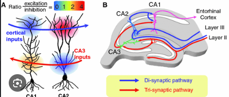
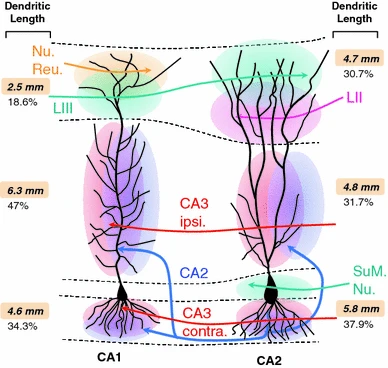

# Dendrites and dendridic computation

## General

Goals: 

- understanding the branching / arbor structure of the neurons we're imaging
- How much branching do we expect

## Pyrimidial CA1 neurons in the hippocampus

- memory formation, autobiographical recall
- 90% of CA1 neurons are glutamatergic pyramidal cells, while the remaining 10% are GABAergic interneurons that regulate the excitation-inhibition balance
- highly specific, continuous sublayers (deep and superficial cells)
- receive inputs directly from the CA3 region (via Schaffer collaterals) and project the final output of the hippocampus to the subiculum and entorhinal cortex
