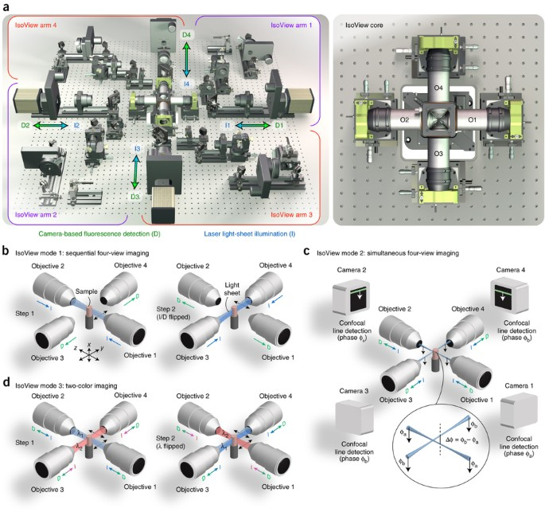
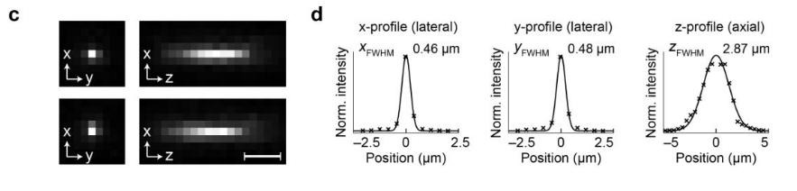
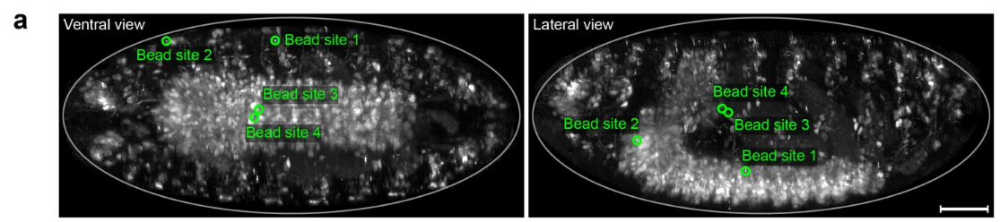
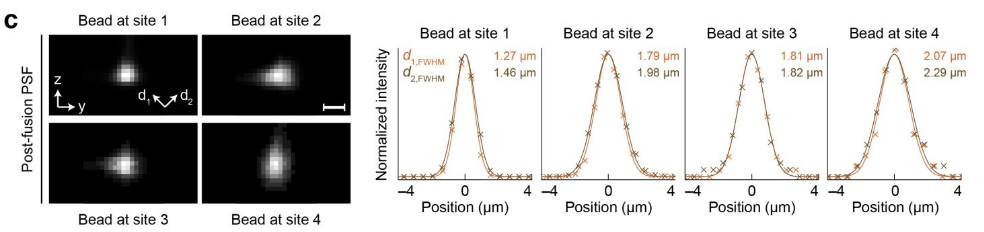

# Chhetri et al. 2015 — Whole-animal functional and developmental imaging with isotropic spatial resolution

**Chhetri, Amat, Wan, Höckendorf, Lemon, Keller — Nature Methods (2015)** · doi:10.1038/nmeth.3632

PDF: _not in repo_ · full text: [source.md](source.md) · [nature.com](https://www.nature.com/articles/nmeth.3632)

## Key takeaways
- Need *at least* 2 additional views (2 -> 4) needed for whole-CNS imaging in larger specimin > 80x80x50um^3
	- 400-fold larger volumes
- Dresophila `@2Hz` with  `1.1-2.5um` resolution
- Zebrafish `@1Hz`
- Multicolor gastrulating drosophila `@0.25hz`

## The microscope

**Figure 1: Isotropic multiview light-sheet microscopy.**

- **4 identicle** orthogonally arranged arms
	- Illuminate with scanned laser light sheet
	- Image emitted fluoresence 

1. PSF before multi-view registration:

2. Inject beads into embryo

3. Multiview-deconv fixes lateral/axial PSF

### Location Matters
- signal strengths at locations near the surface of the embryo (< 20 μm depth, vs the center ~100 μm depth),
- bead fluorescence intensities decrease on average by a factor of 5 in the raw views and by a factor of 6 in the multi-view deconvolved IsoView data
