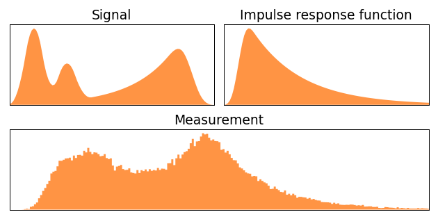

# Guo et al. 2020 — Rapid image deconvolution and multiview fusion for optical microscopy

**Guo, Yamamoto, … Shroff — Nature Biotechnology (2020)** · doi:10.1038/s41587-020-0560-x

PDF: _not in repo_ · [PMC full text](https://pmc.ncbi.nlm.nih.gov/articles/PMC7642198/)

## TL;DR

Fast GPU joint (multiview) Richardson–Lucy deconvolution + registration for light-sheet/optical microscopy — the deconvolution backbone behind the dual-view fusion pipelines in this cluster.

> [!todo]- flesh out
> Placeholder — expand from the PMC full text. Relevant to the dual-view deconvolution work.
