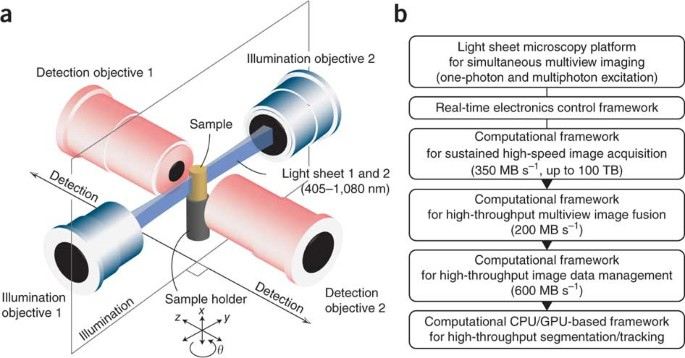

# Tomer et al. 2012 — Quantitative high-speed imaging of entire developing embryos with simultaneous multiview light-sheet microscopy (SiMView)

**Tomer, Khairy, Amat, Keller — Nature Methods (2012)** · doi:10.1038/nmeth.2062

PDF: _not in repo_ · full text: [source.md](source.md) · [nature.com](https://www.nature.com/articles/nmeth.2062)

The foundational **SiMView** paper — simultaneous multiview light-sheet imaging of whole developing embryos. Basis for the IsoView line of work ([[chhetri_keller_2015]]) and the downstream processing pipeline ([[amat_keller_2015]], [[lemon_keller_2015]]).

> [!todo]- flesh out
> Original hand-notes were a stub. Figures are extracted in `figures/` (fig1–6, eq1–6); expand from the full text in `source.md`.
