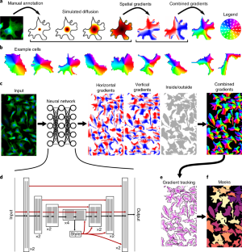

# From U-Net to Cellpose-SAM: Architectural Evolution in Cell Segmentation

Paper: [Cellpose — Stringer et al. 2021](../literature/cellpose_2021/cellpose_2021.md) · usage: [Cellpose](cellpose.md)

An overview of the deep learning architectures underlying modern cellular segmentation, tracing the lineage from the original U-Net through Cellpose and its integration with Meta's Segment Anything Model.

## 1. The U-Net Baseline (2015)

**Paper:** [U-Net: Convolutional Networks for Biomedical Image Segmentation](https://arxiv.org/abs/1505.04597) — Ronneberger, Fischer & Brox

*The original U-Net architecture. The contracting path (left) captures context via repeated convolution and downsampling. The expanding path (right) enables precise localization via upsampling and skip connections from the encoder.*

The U-Net is an encoder-decoder convolutional neural network designed for biomedical image segmentation. Its two defining features are:

- **Symmetric encoder-decoder structure.** The encoder (contracting path) applies repeated 3x3 convolutions and 2x2 max-pooling to progressively reduce spatial resolution while increasing feature channel depth. The decoder (expanding path) mirrors this with upsampling operations to recover full resolution.

- **Skip connections.** Feature maps from each encoder level are concatenated with the corresponding decoder level. This preserves fine-grained spatial information that would otherwise be lost during downsampling, allowing the network to produce precise boundaries.

The output is a dense, per-pixel classification map. For cell segmentation specifically, this means the network predicts "inside cell" vs "background" for every pixel. The limitation is that a raw U-Net only does *semantic* segmentation — it cannot distinguish between individual touching cells. Traditional post-processing (watershed, connected components) is needed to separate instances, and these methods fail on irregularly shaped or tightly packed objects.

## 2. Cellpose 1.0 — Modified U-Net with Gradient Flows (2021)

**Paper:** [Cellpose: a generalist algorithm for cellular segmentation](https://www.nature.com/articles/s41592-020-01018-x) — Stringer, Wang, Michaelos & Pachitariu (HHMI Janelia)

**Code:** [github.com/MouseLand/cellpose](https://github.com/MouseLand/cellpose)

*Cellpose model architecture showing the modified U-Net predicting horizontal and vertical gradient flows plus cell probability. Gradient tracking groups pixels into individual cell masks.*

Cellpose retains the U-Net encoder-decoder skeleton but makes three specific architectural modifications (each individually ablated in Extended Data Fig. 2 of the paper):

### 2.1 Residual Blocks Replace Standard Convolutions

Each spatial scale in the encoder and decoder uses two residual blocks (each containing two 3x3 conv layers with batch norm and ReLU), for a total of four convolution layers per scale. The residual skip connections within each block (borrowed from [ResNet](https://arxiv.org/abs/1512.03385), He et al. 2016) help gradient flow during training, enabling a deeper network without degradation.

### 2.2 Additive Skip Connections Instead of Concatenation

Where the original U-Net concatenates encoder feature maps with decoder feature maps (doubling the channel count), Cellpose combines them additively on the second of four convolutions per spatial scale. This is more parameter-efficient while preserving the spatial detail that skip connections provide.

### 2.3 Global Style Vector

At the network's bottleneck (most downsampled level), Cellpose computes a 256-dimensional **style vector** that encodes a global summary of the input image's appearance — effectively capturing "what kind of image is this" (fluorescence, brightfield, phase contrast, etc.). This vector is linearly projected and broadcast (added) to the feature maps at all subsequent decoder levels.

This mechanism is inspired by neural style transfer ([Gatys et al., 2016](https://arxiv.org/abs/1508.06576)) and style-based GANs ([Karras et al., 2019](https://arxiv.org/abs/1812.04948)). It allows a single generalist model to adapt its segmentation behavior per image without explicit modality labels. The style vector is also reused to estimate cell diameter for automatic image resizing.

### 2.4 The Core Innovation: Gradient Flow Field Representation

Equally important to the backbone changes is Cellpose's output representation. Instead of predicting a binary mask or watershed energy, the network predicts **three outputs per pixel**:

1. **Horizontal gradient flow** (X direction)
2. **Vertical gradient flow** (Y direction)
3. **Cell probability** (sigmoid, inside/outside cell)

These flow fields are derived from a simulated heat diffusion process: a "heat source" is placed at each cell's center of mass and allowed to diffuse only within that cell's mask. The spatial gradient of the resulting energy landscape produces vector fields where every pixel's gradient eventually converges to its cell's center.

At inference time, pixels above the cell probability threshold are iteratively moved along the predicted gradient vectors. Pixels that converge to the same fixed point are assigned the same cell label. This representation is **shape-agnostic** — unlike [StarDist](https://github.com/stardist/stardist) (which assumes star-convex polygons), gradient flows can handle any topology: concave, elongated, branching, or irregular shapes.

The flow consistency is validated post-hoc: the predicted masks are used to recompute expected flows, and the mean squared error against the network's predicted flows is checked. Masks exceeding the `flow_threshold` (default 0.4) are discarded as inconsistent.

## 3. Cellpose 2.0 — Human-in-the-Loop Training (2022)

**Paper:** [Cellpose 2.0: how to train your own model](https://www.nature.com/articles/s41592-022-01663-4) — Pachitariu & Stringer

No architectural changes to the network. Key additions:

- **Human-in-the-loop fine-tuning pipeline** allowing custom models from as few as 100-200 annotated ROIs.
- **Style-based model ensemble.** The style vectors from the bottleneck are clustered (via Leiden algorithm) to group images by segmentation style. Separate models are trained per cluster and dispatched based on input style, forming a small ensemble of specialists within a generalist framework.
- Demonstrated that models pretrained on the Cellpose dataset can be fine-tuned with 500-1,000 user-annotated ROIs to near-full-dataset performance.

## 4. Cellpose 3.0 — Image Restoration (2025)

**Paper:** [Cellpose3: one-click image restoration for improved segmentation](https://www.nature.com/articles/s41592-025-02595-5) — Stringer & Pachitariu

Still the same residual U-Net backbone for segmentation. Added **image restoration networks** (denoising, deblurring) as a learned preprocessing step, trained to produce images that segment well with the generalist model while maintaining perceptual similarity to the originals. This addressed the performance gap on noisy or degraded microscopy data without requiring users to manually preprocess.

## 5. Cellpose-SAM — Transformer Backbone (2025)

**Paper:** [Cellpose-SAM: superhuman generalization for cellular segmentation](https://www.biorxiv.org/content/10.1101/2025.04.28.651001v1) — Pachitariu, Rariden & Stringer (HHMI Janelia)

**Code:** [github.com/MouseLand/cellpose](https://github.com/MouseLand/cellpose) (same repo, `cpsam` model)

**Training notebook:** [train_Cellpose-SAM.ipynb](https://github.com/MouseLand/cellpose/blob/main/notebooks/train_Cellpose-SAM.ipynb)

This is where the architecture changes fundamentally. The residual U-Net is replaced entirely.

### 5.1 Background: Meta's Segment Anything Model (SAM)

**Paper:** [Segment Anything](https://arxiv.org/abs/2304.02643) — Kirillov et al. (Meta AI, 2023)

_SAM architecture diagram — original hotlink is dead (404); see [Segment Anything (Kirillov et al. 2023)](https://arxiv.org/abs/2304.02643)._
*The Segment Anything Model. A ViT image encoder produces dense embeddings. Prompt and mask decoders enable interactive segmentation via points, boxes, or text prompts. Cellpose-SAM discards everything except the image encoder.*

SAM consists of three components:

- **Image encoder:** A Vision Transformer (ViT-Large/ViT-Huge) that processes images into dense feature embeddings. This is where ~98% of the parameters live (305M of 312M for ViT-L).
- **Prompt encoder:** Encodes user-provided prompts (points, bounding boxes, text) into tokens.
- **Mask decoder:** A lightweight transformer that combines image embeddings with prompt tokens to produce segmentation masks.

SAM was pretrained on SA-1B, a dataset of 11 million diverse natural images containing over 1 billion segmentation masks. This massive pretraining gives the ViT encoder extremely strong general-purpose visual feature representations.

### 5.2 The Cellpose-SAM Architecture

The architectural move is surgical:

- **Keep:** SAM's ViT-L image encoder (305M parameters), initialized from SA-1B pretrained weights.
- **Discard:** SAM's prompt encoder, mask decoder, and the entire interactive prompting paradigm.
- **Attach:** A simple convolutional readout layer (256 channels to 3 output channels) that directly predicts the Cellpose flow fields (horizontal flow, vertical flow, cell probability) from the encoder output.
- **Retain:** The gradient-tracking dynamics and mask reconstruction post-processing from original Cellpose.

Modifications to the ViT encoder itself:

| Parameter | Original SAM | Cellpose-SAM |
|-----------|-------------|--------------|
| Input size | 1024 x 1024 | 256 x 256 |
| Patch size | 16 x 16 | 8 x 8 |
| Attention | Mixed local/global | All global |
| Position embeddings | Adapted via subsampling | Adapted via subsampling |

Despite these changes, the model can still be initialized from SAM's pretrained weights, preserving the benefit of pretraining on 11M natural images.

### 5.3 What Was Eliminated

Several components from previous Cellpose versions are no longer needed:

- **No style vector.** The ViT's global attention mechanisms and pretrained representations subsume the role the style vector played. A zero vector is returned for API compatibility.
- **No diameter estimation model.** Cellpose-SAM was trained on images with ROI diameters from 7.5 to 120 pixels with aggressive size augmentation, making it inherently size-invariant. Specifying diameter is optional.
- **No separate image restoration networks.** Robustness to shot noise, isotropic/anisotropic blur, downsampling, and contrast inversions is baked into the training augmentation pipeline.
- **No channel order sensitivity.** Trained with channel shuffling, so cytoplasm and nuclear channels can be provided in any order.

### 5.4 Performance

The Cellpose-SAM model substantially outperforms inter-human agreement in annotation quality and approaches the theoretical human-consensus bound (where multiple annotators' masks are merged). It drops into the existing Cellpose ecosystem: fine-tuning, human-in-the-loop training, and 3D segmentation (via orthogonal 2D plane projection) all work with the new backbone.

## 6. Architecture Comparison Summary

| Feature | U-Net | Cellpose 1-3 | Cellpose-SAM |
|---------|-------|-------------|--------------|
| **Backbone** | CNN encoder-decoder | Residual CNN encoder-decoder | ViT-L (from SAM) |
| **Skip connections** | Concatenation | Additive | None (no decoder) |
| **Style conditioning** | None | Global style vector | None (implicit in ViT) |
| **Output** | Per-pixel class map | Flow fields + cell prob | Flow fields + cell prob |
| **Instance separation** | Watershed | Gradient tracking | Gradient tracking |
| **Pretraining data** | None (trained from scratch) | ~70K cell objects | SA-1B (1B+ masks, 11M images) + cell data |
| **Parameters** | ~31M | ~13M | ~305M |
| **Size handling** | Manual | Style vector regression | Intrinsic (augmentation) |
| **3D support** | No | Yes (orthogonal 2D planes) | Yes (orthogonal 2D planes) |

## 7. Related Work: Other SAM-Based Cell Segmentation

Several other groups have independently adapted SAM for cell segmentation with different strategies:

- **[CellSAM](https://www.nature.com/articles/s41592-025-02879-w)** (Van Valen lab) — Keeps SAM's full architecture intact and adds a separate object detector (CellFinder, based on Anchor DETR) to automatically generate bounding box prompts. Published in Nature Methods, Dec 2025.

- **[SAMCell](https://www.biorxiv.org/content/10.1101/2025.02.06.636835v1)** — Fine-tunes SAM's full pipeline on microscopy data with a focus on label-free (phase contrast, brightfield) imaging.

- **[micro-sam](https://pmc.ncbi.nlm.nih.gov/articles/PMC11903314/)** (Pape et al.) — Adapts SAM for interactive microscopy segmentation with fine-tuned generalist and specialist models, preserving the interactive prompting paradigm.

The Cellpose-SAM approach is distinct in that it strips SAM down to just the encoder, discards the prompting paradigm entirely, and grafts on the Cellpose flow-field representation. This makes it the most architecturally minimal of the SAM-based approaches while retaining full compatibility with the Cellpose fine-tuning and 3D ecosystem.

## References

1. Ronneberger, O., Fischer, P. & Brox, T. (2015). U-Net: Convolutional Networks for Biomedical Image Segmentation. [arXiv:1505.04597](https://arxiv.org/abs/1505.04597)
2. He, K. et al. (2016). Deep Residual Learning for Image Recognition. [arXiv:1512.03385](https://arxiv.org/abs/1512.03385)
3. Stringer, C. et al. (2021). Cellpose: a generalist algorithm for cellular segmentation. *Nature Methods* 18, 100-106. [DOI](https://doi.org/10.1038/s41592-020-01018-x)
4. Pachitariu, M. & Stringer, C. (2022). Cellpose 2.0: how to train your own model. *Nature Methods*. [DOI](https://doi.org/10.1038/s41592-022-01663-4)
5. Stringer, C. & Pachitariu, M. (2025). Cellpose3: one-click image restoration for improved segmentation. *Nature Methods*. [DOI](https://doi.org/10.1038/s41592-025-02595-5)
6. Kirillov, A. et al. (2023). Segment Anything. [arXiv:2304.02643](https://arxiv.org/abs/2304.02643)
7. Pachitariu, M., Rariden, M. & Stringer, C. (2025). Cellpose-SAM: superhuman generalization for cellular segmentation. *bioRxiv*. [DOI](https://doi.org/10.1101/2025.04.28.651001)
8. Israel, U. et al. (2025). CellSAM: A Foundation Model for Cell Segmentation. *Nature Methods*. [DOI](https://doi.org/10.1038/s41592-025-02879-w)
9. Archit, A. et al. (2025). Segment Anything for Microscopy. *Nature Methods*. [PMC](https://pmc.ncbi.nlm.nih.gov/articles/PMC11903314/)
10. Cellpose Documentation: [cellpose.readthedocs.io](https://cellpose.readthedocs.io/en/latest/)
