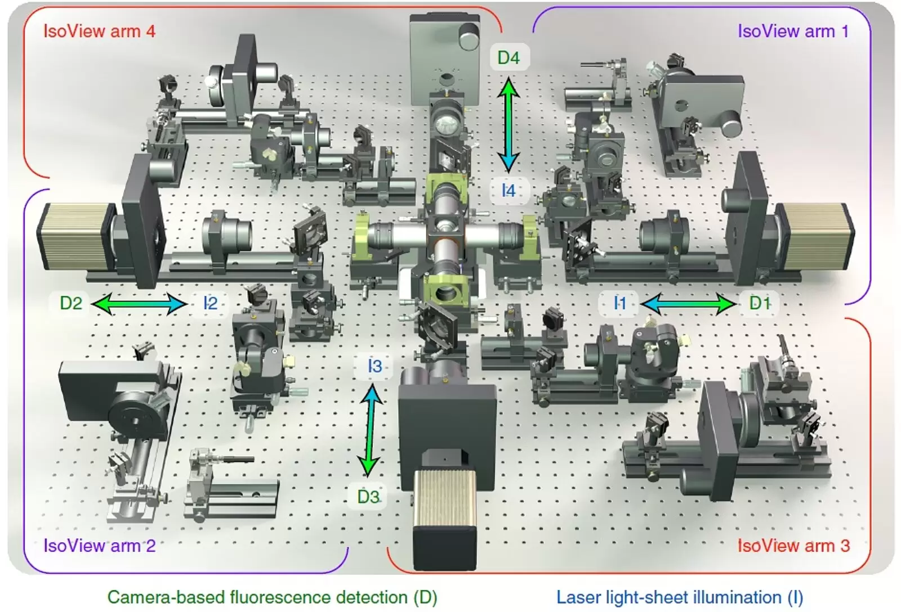

# Isoview Workshop: Data processing

## Walkthrough

1. Orient ourselves with the diagram, sharp features in both cameras exist at different depths.
   Briefly, what comes out of the microscope (raw .stacks).

   ```powershell
   uv run mbo D:\isoview_pipeline_demo\Dme_E1_57C10_GCaMP6s_Simultaneous_6p22_20150528_163012\v0-1-4\Dme_E1_57C10_GCaMP6s_Simultaneous_6p22_20150528_163012\

   uv run mbo D:\isoview_pipeline_demo\Dre_HuC_H2BGCaMP6s_0-1_20150709_195932.corrected.registered\SPM00
   ```

2. Camera-camera blending

   Show Dre_HUC after camera-camera fusion (CM -> VW).

3. View - Fusion / Multiview deconvolution

- Before / after RL deconvolution
- Advantages (increased sharpness / signal recovery) and disadvantages (long processing time, need good PSF)

4. Tiled: midgut dataset

- show pre-stitched data in bigstitcher
- show stitched, fused result

With pyramids:
https://webknossos.org/annotations/698ca6390100001d0156844f#1064,1045,318,0,1.145

Without pyramids:

https://webknossos.org/datasets/SPM00_TL1_CM00_CM01_VW00.fusedStack.zarr-699717e8010000b301dd4203/view#769,1321,233,0,1.772

## Suppliments

- Add some figures from lecture



- **X**: ceiling to floor (vertical/gravity axis)
- **Y**: horizontal
- **Z**: horizontal (detection/scan axis)

Pros:

- higher resolution imaging of larger samples, allows functional, whole brain, multicolor
- no increased photodamage
- maintain fast camera-dependent frame rate

Cons:

- highly light-scattering tissue will not work well
- limited lateral motion of the sample during acquisition
- depth-dependent signal loss
- complex post-processing computation

### Comments

3-5min
- start with the raw data
- start with multiple 3D stacks, folder/filename structure 
- Appreciate how quickly this can balloon, 1 tp is 1GB but imagine you have multiple specimen, multiple timepoint
  - touch on file format here

1-2min
File format: Ome-zarr v3 with pyramids is a must

15-20min (give change to explore and ask questions) 
Viewers, tools you can use: 
- mbo-studio, show the cameras, we need to align/register these cameras to get 1 representation that is accurate
- go to bdv, allows us to all views together, large datasets that we can view due to pyramids, especially important to quickly process on a subsampled scale, exploratory analysis to do these large computational steps on a smaller scale

## Walkthrough 2

Raw Files

X:\isoview\rchhetri\2015-07-09_Dre_HuC_H2BGCaMP6s\Dre_HuC_H2BGCaMP6s_0-1_20150709_195932.corrected\SPM00
- 3600 timepoints
- 970 GB 
- 1 specimen
